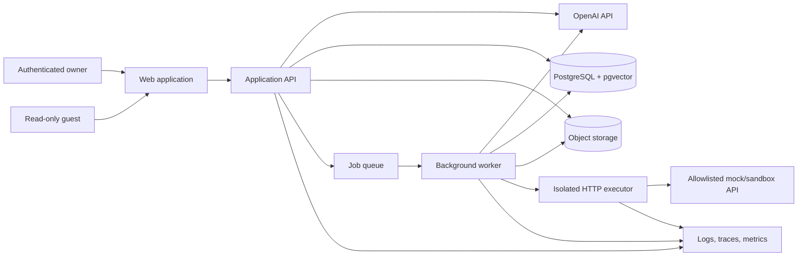
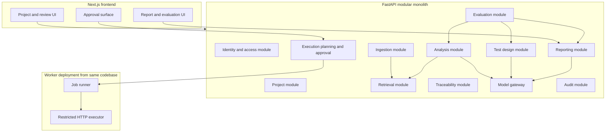
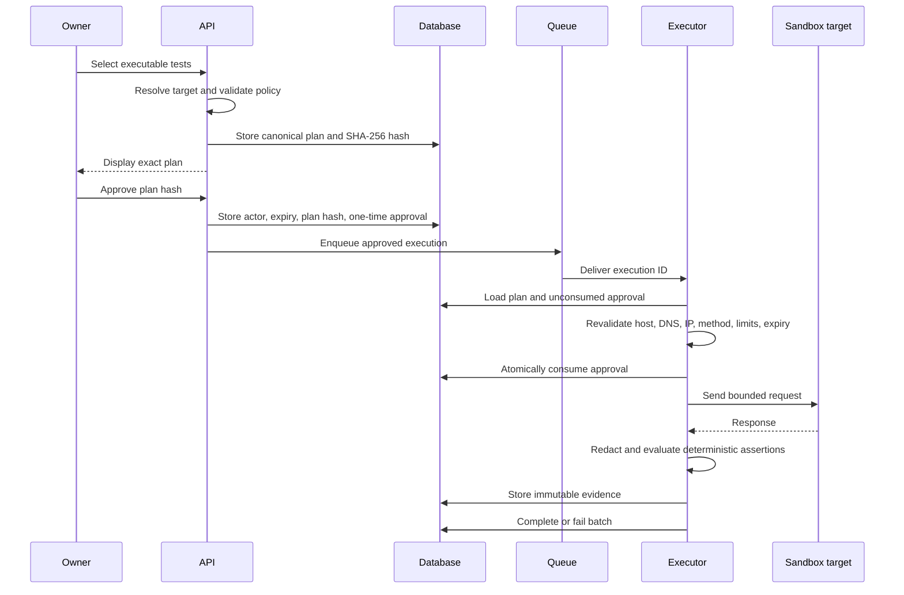
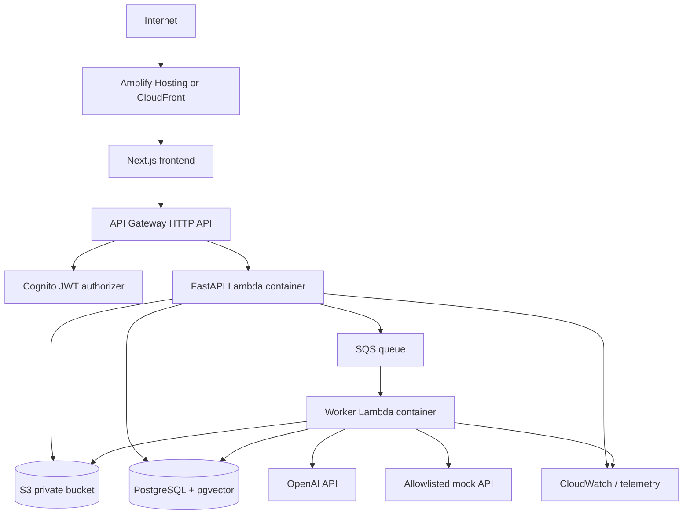

# Architecture — AI Quality Engineering Copilot

**Document status:** Approved working baseline  
**Version:** 0.2  
**Last updated:** 2026-07-17  
**Architecture style:** Modular monolith with isolated execution boundary

## 1. Architecture objectives

The architecture must demonstrate production AI-engineering skill without becoming a distributed-systems exercise. It prioritizes:

1. Evidence-grounded AI outputs.
2. Deterministic workflow and security controls.
3. Explicit human approval before side effects.
4. Reproducible evaluation and provenance.
5. Low-cost public deployment.
6. Clear module boundaries and testability.
7. A complete vertical slice before optional sophistication.

## 2. Key decisions

| Decision | Selected direction | Rationale |
|---|---|---|
| Application shape | Modular monolith | Preserves clean boundaries without microservice overhead |
| AI orchestration | Deterministic application workflow using the OpenAI Responses API directly | Application owns state, tool dispatch, validation, approval, and retries |
| Agents | No multi-agent system in MVP | Multiple agents require measured benefit, not architectural theater |
| Model output | Strict versioned schemas validated with Pydantic | Converts stochastic output into explicit contracts |
| Retrieval | PostgreSQL full-text search plus pgvector, combined through rank fusion | Handles exact requirement identifiers and semantic matches |
| Side effects | Model proposes; deterministic code validates; human approves; isolated executor acts | Prevents the model from having unrestricted network authority |
| Production cloud | AWS-first, Terraform-managed | Aligns with existing experience and demonstrates infrastructure ownership |
| Data | PostgreSQL plus S3-compatible object storage | Strong relational provenance with vector retrieval and durable raw files |
| Background work | Database-backed job state plus SQS worker in production | Supports retries and asynchronous progress without introducing a workflow platform initially |
| Public access | Authenticated owner plus read-only guest demo | Demonstrates a usable product while minimizing public attack surface |

## 3. System context



## 4. Container and module view



The API and worker are separate deployment units but share the same repository, domain models, migrations, validation rules, and observability libraries.

## 5. Repository structure

```text
ai-quality-engineering-copilot/
├── apps/
│   ├── web/                       # Next.js application
│   └── api/                       # FastAPI entry point
├── packages/
│   ├── contracts/                 # JSON Schema/OpenAPI/shared generated types
│   └── ui/                        # Optional shared UI components
├── backend/
│   ├── domain/                    # Entities, value objects, policies
│   ├── application/               # Use cases and workflow orchestration
│   ├── infrastructure/            # Database, S3, OpenAI, queues, telemetry
│   ├── modules/
│   │   ├── identity/
│   │   ├── projects/
│   │   ├── ingestion/
│   │   ├── retrieval/
│   │   ├── analysis/
│   │   ├── test_design/
│   │   ├── traceability/
│   │   ├── execution/
│   │   ├── reporting/
│   │   └── evaluation/
│   ├── prompts/                   # Versioned prompt templates
│   ├── schemas/                   # Pydantic and generated JSON Schemas
│   └── worker.py
├── evaluation/
│   ├── datasets/
│   ├── rubrics/
│   ├── scorers/
│   ├── baselines/
│   └── reports/
├── fixtures/
│   ├── requirements/
│   ├── openapi/
│   └── mock-api/
├── infrastructure/
│   ├── modules/
│   └── environments/
├── tests/
│   ├── unit/
│   ├── integration/
│   ├── contract/
│   ├── security/
│   └── e2e/
├── docs/
│   ├── adr/
│   ├── architecture/
│   └── operations/
├── .github/workflows/
├── docker-compose.yml
├── Makefile
├── pyproject.toml
├── package.json
├── .env.example
└── README.md
```

## 6. Domain boundaries

### Identity

- Maps Cognito or local-development identities to internal users.
- Enforces owner versus read-only guest permissions.
- Does not delegate authorization decisions to the LLM.

### Projects

- Owns project lifecycle and project-scoped access.
- Provides the aggregate boundary for documents, analyses, tests, executions, and reports.

### Ingestion

- Applies authorization, streamed byte limits, declared-type checks, and content-signature checks before parser work.
- Stores accepted upload bytes only in private quarantine under generated object keys; a quarantined object is not an active document version.
- Enqueues an opaque document identifier for a restricted parser worker rather than exposing raw input to application, model, or executor processes.
- Promotes a document only after isolated parser acceptance and then stores immutable normalized sections, source locations, content hash, and parser provenance.
- Emits a sanitized rejection audit record for parser-policy, malformed-input, external-reference, timeout, and resource-limit failures.
- Never interprets embedded document instructions as system commands or allows a rejected document to reach retrieval, embeddings, model calls, reports, or execution eligibility.

### Quarantine parser-worker boundary

- The parser worker runs non-root with no network egress, no model, cloud, or executor credentials, a read-only filesystem, bounded temporary storage, and OS-enforced time and memory limits.
- It reads only the quarantined object identified by its job and may write only a bounded normalized result or sanitized rejection outcome.
- Parser workers do not resolve external references, fetch URLs, execute active PDF content, render documents, run OCR, or invoke converters.
- Parser acceptance is the only transition that permits chunking, embedding, and retrieval.

### Retrieval

- Chunks normalized content.
- Computes embeddings.
- Maintains PostgreSQL full-text indexes and pgvector indexes.
- Executes project-scoped hybrid retrieval.
- Records retrieval provenance.

### Analysis

- Runs requirement-quality and requirement/OpenAPI consistency workflows.
- Uses retrieved evidence and deterministic contract analysis.
- Produces typed findings.

### Test design

- Generates typed tests with evidence links.
- Applies deterministic normalization, duplicate detection, and execution eligibility checks.

### Traceability

- Maintains source-to-finding, source-to-test, operation-to-test, and test-to-execution relationships.
- Marks stale links after source revisions.

### Execution

- Creates immutable plans.
- Records approval.
- Performs network policy validation.
- Executes deterministic HTTP requests and assertions.
- Stores redacted evidence.

### Reporting

- Aggregates deterministic facts and AI analysis.
- Generates web, Markdown, and JSON reports.
- Clearly labels provenance and limitations.

### Evaluation

- Executes versioned benchmark cases.
- Runs deterministic and model-based scorers.
- Compares candidate configurations against baselines.
- Produces release-gate results.

## 7. Core processing flows

### 7.1 Ingestion

```mermaid
sequenceDiagram
    participant U as Owner
    participant A as API and quarantine
    participant Q as Ingestion queue
    participant P as Restricted parser
    participant D as PostgreSQL

    U->>A: Upload file
    A->>A: Authorize and stream preflight checks
    A->>A: Store private quarantine object
    A->>D: Record pending document and hash
    A->>Q: Enqueue opaque document identifier
    A-->>U: 202 Accepted plus job ID
    Q->>P: Deliver parser job
    P->>P: Isolated parse with no egress
    alt Parser accepted
        P->>D: Store normalized sections, locations, and provenance
        P->>D: Mark accepted and enqueue retrieval work
    else Parser rejected
        P->>D: Store sanitized rejection audit only
        P->>D: Mark rejected; no retrieval work
    end
```

The API performs only bounded preflight checks. It does not parse untrusted content. The restricted parser worker promotes only accepted normalized output. Retrieval, chunking, embeddings, and model calls begin only after the accepted state is persisted.

A parser-policy failure, malformed input, unsupported type, external reference, timeout, or resource limit is terminal for that document version. It produces no chunks, vectors, model calls, execution candidates, or automatic parser retry.

### 7.2 Grounded analysis and test generation

1. Load exact project and document versions.
2. Run deterministic extraction from requirements and OpenAPI.
3. Form focused retrieval queries for each analysis objective.
4. Retrieve lexical and semantic candidates within the project boundary.
5. Combine ranks and enforce evidence-size limits.
6. Call the model with task instructions, typed schema, and evidence blocks.
7. Validate the model response.
8. Run deterministic post-validation:
   - citation existence and project ownership;
   - source-location validity;
   - controlled taxonomy;
   - duplicate and unsupported-link checks;
   - execution eligibility.
9. Persist output and full provenance.
10. Return explicit partial failure when one stage cannot complete.

### 7.3 Approval and execution



The model cannot bypass this sequence. It may propose test definitions, but it cannot create a valid approval or invoke an unrestricted network client.

## 8. AI interaction design

### 8.1 Model gateway

A small `ModelGateway` interface shall own:

- Provider authentication.
- Request timeouts and bounded retries.
- Model and parameter allowlists.
- Structured response schemas.
- Usage and cost extraction.
- Correlation and trace identifiers.
- Redaction policy.
- Error normalization.

No domain module calls the provider SDK directly.

### 8.2 Workflow strategy

The MVP uses direct Responses API calls coordinated by application services. This is preferred because the workflow must preserve deterministic state and explicit boundaries.

The Agents SDK may be evaluated after the baseline for a single orchestrator if its human-interruption, tracing, or session capabilities reduce code and improve measured reliability. It is not a reason to introduce multiple collaborating agents.

### 8.3 Structured outputs

Every material AI output has a versioned schema. Examples:

- `RequirementFindingV1`
- `ContractMismatchV1`
- `GeneratedTestCaseV1`
- `FailureAnalysisV1`
- `QualityReportNarrativeV1`

Validation policy:

1. Request strict schema-conforming output.
2. Reject unknown categories and malformed citations.
3. Permit one bounded repair attempt for recoverable format errors.
4. Record both original and repaired attempts.
5. Fail explicitly rather than accepting unvalidated prose.

### 8.4 Prompt management

- Prompt templates are stored in source control.
- Each template has an immutable semantic version.
- The database records template version and content hash.
- Prompt changes require an evaluation comparison.
- Immutable application policy, task instructions, schemas, model configuration, target registry, approval state, and evaluation thresholds are created only by server-side code.
- Every evidence object carries immutable source ID, project ID, document version ID, source location, content hash, and `trust_level=untrusted`.
- Untrusted evidence is serialized only as data. It cannot create system or developer messages, tool definitions, schemas, targets, headers, credentials, approvals, feature flags, or evaluation configuration.
- Retrieval occurs before the model call. The model never receives a network, filesystem, shell, approval, administration, credential, or unrestricted HTTP capability.
- Model citations are restricted to the retrieved immutable candidate IDs for the current project and source version; fabricated or foreign citations fail post-validation.
- OpenAPI `servers`, descriptions, examples, callbacks, `externalDocs`, `externalValue`, URLs, and `x-*` extensions are untrusted evidence only and cannot register or alter an execution target.
- Distinct delimiters improve model behavior but are not the security control. Deterministic policy validation remains authoritative even when prompt-injection detection misses an attack.

### 8.5 Model routing

Initial routing is deterministic:

- Low-cost model for classification, extraction, and simple normalization.
- Stronger model for contradiction analysis, complex test generation, and failure analysis.
- No dynamic self-selected model routing in MVP.

Routing changes require comparison on task success, cost, and latency.

## 9. Retrieval architecture

### 9.1 Normalized source representation

Each source unit stores:

- Project ID.
- Document ID and immutable version ID.
- Document type.
- Source location: heading and line range, page range, or JSON Pointer.
- Normalized text.
- Content hash.
- Parser version.
- Chunking version.
- Embedding model/version.
- `trust_level`, initially `untrusted`, and a security-label set.
- Parser admission state: `quarantined`, `accepted`, or `rejected`.
- Retention state.

Only accepted normalized source units can be chunked or embedded. Rejected documents retain only the private quarantine object, content hash, sanitized failure code, timestamp, and safe source-location metadata required for audit and deletion workflows.

### 9.2 Chunking

- Requirements are chunked by requirement ID and heading boundaries.
- OpenAPI is chunked by operation, component schema, security scheme, and shared response.
- PDFs are chunked by structural page/heading boundaries where reliable.
- Large units use bounded overlap; small logical units remain intact.
- Chunking configuration is versioned and evaluated.

### 9.3 Hybrid retrieval

Candidate sets:

1. PostgreSQL full-text retrieval for exact IDs, field names, statuses, and terminology.
2. pgvector similarity retrieval for semantic matches.
3. Optional deterministic filters by document type, operation, requirement ID, or source version.

Results are combined through reciprocal-rank fusion or another documented score-fusion method. A later reranker is allowed only when evaluation demonstrates enough improvement to justify cost and latency.

### 9.4 Citation validation

A citation is valid only when:

- It references a chunk in the same project.
- It references an allowed source version.
- The stored source location exists.
- The quoted or paraphrased claim is supported according to human or automated evaluation.

The system must distinguish citation existence from citation correctness.

## 10. Data architecture

### 10.1 PostgreSQL

PostgreSQL stores relational state, provenance, full-text indexes, and vectors.

Key integrity rules:

- All project-owned rows include `project_id`.
- Foreign keys preserve source and configuration provenance.
- Immutable artifacts use append-only revisions rather than in-place mutation.
- Approvals and audit events are append-only.
- Project-scope checks are applied in application queries and reinforced with row-level security if feasible.
- Migration scripts are versioned and tested against realistic fixtures.

### 10.2 Object storage

Object storage contains:

- Raw uploaded files.
- Optional sanitized exports.
- Large generated reports or evaluation artifacts.

Controls:

- Server-side encryption.
- Private buckets.
- Short-lived signed access through the API.
- Content-type and download-disposition headers.
- Lifecycle expiration for demo uploads.
- Object keys based on non-guessable IDs, not user filenames.

### 10.3 Cache

No distributed cache is required initially. Application-level caching may be introduced for:

- Embeddings keyed by normalized content hash and model version.
- Deterministic parser output.
- Stable public demo artifacts.

Caching must not weaken project isolation or hide configuration changes.

## 11. HTTP execution security architecture

### 11.1 Security invariants

- The model never controls a general-purpose HTTP client.
- Targets are selected from server-side environment definitions, not arbitrary model URLs.
- OpenAPI `servers`, examples, descriptions, and extensions are untrusted suggestions.
- Every plan is canonicalized and hashed.
- Every approval is one-time, actor-bound, plan-bound, and time-bound.
- Network policy is validated at plan creation and immediately before connection.
- Assertions are deterministic code.
- Redirects are disabled in MVP.

### 11.2 Target validation

Validation includes:

1. Parse and normalize scheme, host, port, path, and query.
2. Require configured target ID and allowed base URL.
3. Require HTTPS except explicit local development.
4. Resolve all addresses.
5. Reject loopback, private, link-local, multicast, unspecified, reserved, and cloud-metadata addresses.
6. Reject credentials in URLs and non-allowed ports.
7. Re-resolve immediately before connect.
8. Disable redirects.
9. Verify TLS normally; no insecure bypass in production.
10. Apply request, response, timeout, concurrency, and quota limits.

### 11.3 Executor isolation

The executor runs as a distinct worker entry point with:

- A minimal IAM role.
- No permission to modify user identity or infrastructure.
- Read access only to approved execution state and necessary encrypted secrets.
- Write access only to execution evidence and audit state.
- No ability to create new allowlisted hosts at runtime.
- Separate telemetry labels and alarms.

## 12. Production deployment

### 12.1 AWS target



### 12.2 Database deployment decision

Logical code depends only on a PostgreSQL connection and pgvector support.

Preferred all-AWS candidate:

- Aurora PostgreSQL Serverless v2.
- Engine/platform version that supports automatic pause to 0 ACUs.
- Low minimum capacity, bounded maximum capacity, deletion protection outside ephemeral environments, encrypted storage, and private networking.

The final production selection is a cost-gate decision. If the all-AWS baseline cannot stay within the monthly limit, an external serverless PostgreSQL provider with pgvector may be used while AWS remains the application and object-storage platform. This trade-off must be documented rather than hidden.

### 12.3 Infrastructure modules

Terraform modules should cover:

- Network and security groups where required.
- Frontend hosting.
- API Gateway.
- Cognito.
- Lambda API and worker.
- SQS and dead-letter queue.
- S3 and lifecycle rules.
- Database and secret management.
- CloudWatch logs, dashboards, alarms, and budgets.
- IAM roles and policies.
- Mock sandbox API.

Environments:

- `local`: Docker Compose, local auth bypass restricted to development.
- `preview`: optional short-lived environment for selected pull requests.
- `production`: public portfolio deployment.

## 13. Local development

Expected prerequisites:

- Docker and Docker Compose.
- Python toolchain.
- Node.js toolchain.
- Make or equivalent task runner.

Target commands:

```bash
cp .env.example .env
make bootstrap
make dev
make test
make eval-smoke
```

Local services:

- Next.js frontend.
- FastAPI backend.
- Worker.
- PostgreSQL with pgvector.
- Local S3-compatible object storage or filesystem adapter.
- Synthetic mock order API.

Production-specific adapters are selected through environment configuration, not conditional domain logic.

## 14. Observability

### 14.1 Trace model

One correlation tree connects:

- Browser action.
- API request.
- Job.
- Retrieval query and selected chunks.
- Model call and usage.
- Validation and repair attempt.
- Approval.
- HTTP execution.
- Report generation.
- Evaluation case and score.

### 14.2 Metrics

Product:

- Projects created.
- Documents ingested successfully/failed.
- Findings accepted/rejected.
- Tests accepted/edited/rejected.
- Plans approved/rejected/expired.
- Executions passed/failed/blocked.

AI:

- Calls, tokens, estimated cost, retries, timeouts.
- Structured-output validity.
- Citation validation failure.
- Retrieval candidate count and score distribution.
- Model-specific task success.

Operational:

- API and worker errors.
- Queue depth and age.
- p50/p95 latency.
- Database connections and capacity.
- Storage usage.
- Daily/monthly spend and quota consumption.

Security:

- Blocked destinations.
- Approval failures and replays.
- Prompt-injection detections.
- Authentication failures.
- File-policy rejections.
- Rate-limit and quota enforcement.

### 14.3 Logging

Logs are structured JSON and include correlation IDs. They exclude:

- Authorization headers.
- Cookies.
- Raw tokens and API keys.
- Full document bodies by default.
- Unredacted HTTP bodies designated sensitive.

## 15. Reliability and failure handling

| Failure | Required behavior |
|---|---|
| Model timeout or rate limit | Bounded retry with jitter; record attempt; preserve job state |
| Invalid structured output | One bounded repair attempt; then explicit failure |
| Embedding failure | Retry batch safely; do not mark document fully indexed |
| Parser-policy failure, malformed input, unsupported type, external reference, timeout, or resource limit | Keep raw bytes private in quarantine; persist only a sanitized rejection code, timestamp, and safe location metadata. Do not retry. Create zero chunks, embeddings, model calls, execution candidates, or reports. |
| Queue duplicate | Idempotency key prevents duplicate side effects |
| Worker crash | Visibility timeout and retry; dead-letter after bounded attempts |
| Database unavailable | Fail safely; do not execute from stale approval state |
| Approval expired or replayed | Reject before network request |
| Target DNS changes | Revalidate immediately before connect and block unsafe address |
| Oversized response | Stop reading at limit; store truncated indicator; fail relevant assertion |
| Provider configuration change | New version; old runs remain reproducible from metadata |
| Deployment regression | Automated health checks and documented rollback |

## 16. Cost controls

- Use task-specific model routing rather than strongest model everywhere.
- Cache embeddings by content hash and embedding version.
- Limit retrieved evidence size.
- Limit retries and output tokens.
- Do not run full evaluations on every pull request.
- Enforce daily owner and public-demo quotas.
- Auto-pause or scale-to-zero eligible infrastructure.
- Expire unused demo files and preview environments.
- Maintain application-level spend circuit breakers in addition to cloud budgets.
- Report cost per successful workflow, not cost per model call alone.

## 17. Testing architecture

| Layer | Examples |
|---|---|
| Unit | URL policy, schema validation, state transitions, rank fusion, cost calculations |
| Integration | PostgreSQL repositories, pgvector retrieval, S3 adapter, queue idempotency |
| Contract | Frontend/API schemas, OpenAI gateway adapter, mock API/OpenAPI consistency |
| Security | Parser-profile boundaries for size, nesting, nodes, aliases, references, decompression, timeouts, and malformed input; parser no-egress/isolation checks; SSRF, DNS rebinding, approval replay, untrusted-document and retrieved-content prompt injection, fabricated citations, metadata URL/target mutation, XSS, and redaction |
| AI evaluation | Findings, tests, citations, tool planning, failure analysis |
| End-to-end | Upload → analysis → test generation → approval → sandbox execution → report |
| Infrastructure | Terraform validation, policy scanning, container scanning, deployment smoke test |

## 18. Architecture evolution criteria

A new service, agent, model provider, cache, workflow engine, or reranker requires:

1. A measured problem in the current architecture.
2. A documented hypothesis.
3. A comparison against the baseline.
4. A clear operational and cost impact.
5. A rollback path.

Examples:

- Add a reranker only when retrieval evaluation shows a meaningful gap.
- Add Agents SDK orchestration only when it reduces approval/session complexity or improves reliability.
- Add a second model provider only when resilience or cost evidence justifies it.
- Add browser execution only after API execution and safety gates are complete.

## 19. Initial architecture decision records to create

- ADR-001: Modular monolith instead of microservices.
- ADR-002: Direct Responses API orchestration instead of a multi-agent framework.
- ADR-003: PostgreSQL full-text plus pgvector hybrid retrieval.
- ADR-004: Model-proposes / code-validates / human-approves / executor-acts security pattern.
- ADR-005: AWS serverless application tier and production database selection.
- ADR-006: Synthetic/public data and read-only guest demonstration.
- ADR-007: Three-level evaluation strategy in CI.

## 20. Current external references

Technical behavior must be rechecked during implementation because platform capabilities change. Initial references:

- OpenAI Agents SDK human approval: <https://openai.github.io/openai-agents-python/human_in_the_loop/>
- OpenAI Agents SDK guardrails: <https://openai.github.io/openai-agents-python/guardrails/>
- OpenAI Agents SDK guidance on direct Responses API versus SDK: <https://openai.github.io/openai-agents-python/>
- AWS Aurora Serverless v2 auto-pause: <https://docs.aws.amazon.com/AmazonRDS/latest/AuroraUserGuide/aurora-serverless-v2-auto-pause.html>
