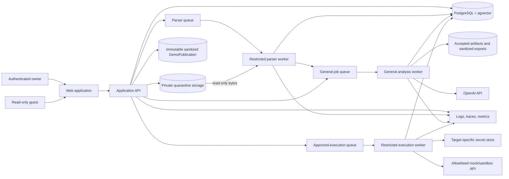
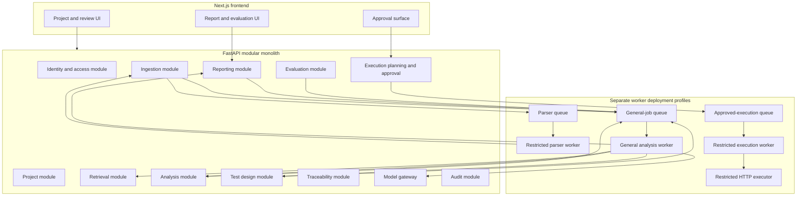
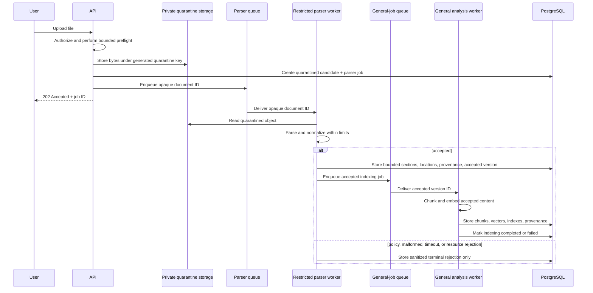
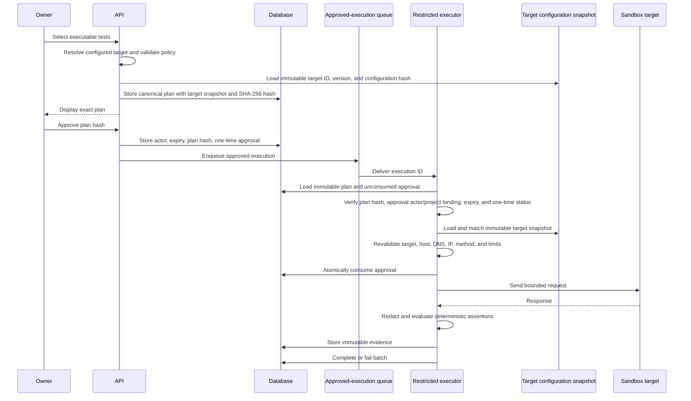
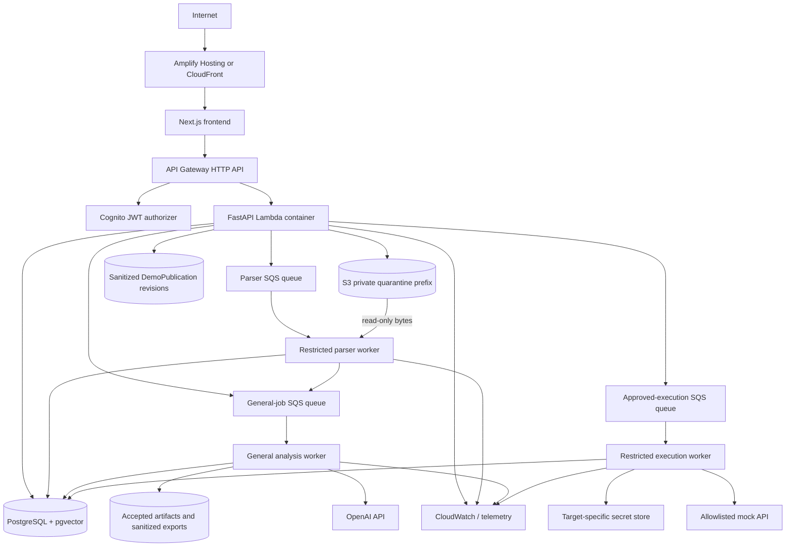

# Architecture — AI Quality Engineering Copilot

**Document status:** Approved working baseline
**Version:** 0.2
**Last updated:** 2026-07-17
**Architecture style:** Modular monolith with isolated execution boundary

See the [Control Traceability Matrix](CONTROL_TRACEABILITY_MATRIX.md) for the
mapping from requirements and threats to architecture decisions, fixtures,
scorers, release gates, and backlog items.

## 1. Architecture objectives

The architecture must demonstrate production AI-engineering skill without becoming a distributed-systems exercise. It prioritizes:

1. Evidence-grounded AI outputs.
2. Deterministic workflow and security controls.
3. Explicit human approval before side effects.
4. Reproducible evaluation and provenance.
5. Low-cost public deployment.
6. Clear module boundaries and testability.
7. A complete vertical slice before optional sophistication.

## 2. Key decisions

| Decision | Selected direction | Rationale |
|---|---|---|
| Application shape | Modular monolith | Preserves clean boundaries without microservice overhead |
| AI orchestration | Deterministic application workflow using the OpenAI Responses API directly | Application owns state, tool dispatch, validation, approval, and retries |
| Agents | No multi-agent system in MVP | Multiple agents require measured benefit, not architectural theater |
| Model output | Strict versioned schemas validated with Pydantic | Converts stochastic output into explicit contracts |
| Retrieval | PostgreSQL full-text search plus pgvector, combined through rank fusion | Handles exact requirement identifiers and semantic matches |
| Side effects | Model proposes; deterministic code validates; owner approves; a restricted execution worker revalidates and invokes the executor | Prevents the API, model, and general worker from gaining target-network authority |
| Production cloud | AWS-first, Terraform-managed | Aligns with existing experience and demonstrates infrastructure ownership |
| Data | PostgreSQL plus S3-compatible object storage | Strong relational provenance with vector retrieval and durable raw files |
| Background work | Durable database-backed job state plus separate parser, general-job, and approved-execution queues with private worker roles | Keeps untrusted parsing, AI work, and outbound HTTP execution independently least-privileged without introducing domain microservices |
| Public access | Authenticated owner plus read-only guest demo | Demonstrates a usable product while minimizing public attack surface |
| Document ingestion | Quarantine-first object storage and isolated parsing of every uploaded file | Treats file bytes, metadata, parsed text, and OpenAPI content as untrusted before retrieval or model use |

## 3. System context



## 4. Container and module view



The API, parser worker, general worker, and restricted executor are separate deployment profiles that share the same repository, domain models, migrations, validation rules, and observability libraries. Shared code must not imply shared credentials, queue permissions, database roles, object-store access, or network egress.

## 5. Repository structure

```text
ai-quality-engineering-copilot/
├── apps/
│   ├── web/                       # Next.js application
│   └── api/                       # FastAPI entry point
├── packages/
│   ├── contracts/                 # JSON Schema/OpenAPI/shared generated types
│   └── ui/                        # Optional shared UI components
├── backend/
│   ├── domain/                    # Entities, value objects, policies
│   ├── application/               # Use cases and workflow orchestration
│   ├── infrastructure/            # Database, S3, OpenAI, queues, telemetry
│   ├── modules/
│   │   ├── identity/
│   │   ├── projects/
│   │   ├── ingestion/
│   │   ├── retrieval/
│   │   ├── analysis/
│   │   ├── test_design/
│   │   ├── traceability/
│   │   ├── execution/
│   │   ├── reporting/
│   │   └── evaluation/
│   ├── prompts/                   # Versioned prompt templates
│   ├── schemas/                   # Pydantic and generated JSON Schemas
│   └── workers/
│       ├── parser_worker.py        # Quarantine-only parser entry point
│       ├── general_worker.py       # AI, indexing, reporting, and evaluation work
│       └── executor_worker.py      # Approved-execution-only entry point
├── evaluation/
│   ├── datasets/
│   ├── rubrics/
│   ├── scorers/
│   ├── baselines/
│   └── reports/
├── fixtures/
│   ├── requirements/
│   ├── openapi/
│   └── mock-api/
├── infrastructure/
│   ├── modules/
│   └── environments/
├── tests/
│   ├── unit/
│   ├── integration/
│   ├── contract/
│   ├── security/
│   └── e2e/
├── docs/
│   ├── adr/
│   ├── architecture/
│   └── operations/
├── .github/workflows/
├── docker-compose.yml
├── Makefile
├── pyproject.toml
├── package.json
├── .env.example
└── README.md
```

## 6. Domain boundaries

### Identity

- Maps Cognito or local-development identities to internal users.
- Enforces owner versus read-only guest permissions.
- Does not delegate authorization decisions to the LLM.

### Projects

- Owns project lifecycle and project-scoped access.
- Provides the aggregate boundary for documents, analyses, tests, executions, and reports.

### Ingestion

- Performs only bounded preflight checks in the API.
- Stores eligible bytes under generated private quarantine keys.
- Sends opaque document identifiers to the restricted parser queue.
- Promotes only parser-accepted normalized sections and source locations.
- Never interprets embedded document instructions as system commands.

### Retrieval

- Receives only accepted normalized content.
- Chunks normalized content through the general worker.
- Computes embeddings.
- Maintains PostgreSQL full-text indexes and pgvector indexes.
- Executes project-scoped hybrid retrieval.
- Records retrieval provenance.

### Analysis

- Runs requirement-quality and requirement/OpenAPI consistency workflows.
- Uses retrieved evidence and deterministic contract analysis.
- Produces typed findings.

### Test design

- Generates typed tests with evidence links.
- Applies deterministic normalization, duplicate detection, and execution eligibility checks.

### Traceability

- Maintains source-to-finding, source-to-test, operation-to-test, and test-to-execution relationships.
- Marks stale links after source revisions.

### Execution

- Creates immutable plans.
- Records approval.
- Performs network policy validation.
- Sends an approved execution ID only to the restricted execution queue.
- Executes deterministic HTTP requests and assertions only in the restricted executor.
- Stores redacted evidence.

### Reporting

- Aggregates deterministic facts and AI analysis.
- Generates web, Markdown, and JSON reports.
- Uses immutable canonical report revisions with validated citations and provenance.
- Renders source, model, and target-response content only as escaped text or a strict sanitized Markdown subset; raw model HTML is prohibited.
- Clearly labels provenance, limitations, and unsupported/not-run states.

### Evaluation

- Executes versioned benchmark cases from the fixture manifest and ground-truth registry.
- Runs deterministic and model-based scorers.
- Compares named B0/B1/B2 configurations according to the evaluation plan.
- Produces release-gate results.
- Uses fake resolver and transport adapters for policy fixtures; evaluation does not grant a real target-side-effect capability.

### Public demo

- Resolves guest reads only through the server-selected immutable sanitized `DemoPublication`.
- Does not expose generic project, object, export, report-regeneration, job, or execution routes to guests.

### Ingestion and parser trust boundary

All uploaded bytes, filenames, MIME declarations, document metadata, parsed text, OpenAPI fields, XML, YAML, JSON, PDF contents, descriptions, examples, server URLs, and test-result fields are untrusted input. The MVP admission policy supports only Markdown, text, PDF, and OpenAPI YAML/JSON; XML, JUnit, generic JSON result files, archives, Office files, executables, and macros are rejected before parsing.

The API performs only bounded streaming checks: authentication, project authorization, extension/media-type allowlisting, content-signature checks where feasible, and configured size/count/page limits. Eligible bytes are stored with generated object keys in a private quarantine namespace. The request path does not invoke complex parsers.

A restricted parser worker reads an opaque queued document identifier and the corresponding quarantined object. It runs non-root, with a read-only root filesystem, bounded temporary storage, CPU, memory, wall-clock, nesting, and retry limits. It has no public Internet, model-provider credential, executor-target, target-secret, or general-worker capability; it may access only the private storage, parser queue, restricted database role, and telemetry endpoints needed for its role.

Its workload identity permits only those named data-plane endpoints; it has no cloud control-plane or unrelated cloud credentials.

Only a successful parse may create bounded normalized sections, source locations, parser provenance, and a follow-on general indexing job. Raw bytes remain private quarantine objects regardless of acceptance; acceptance promotes only the normalized representation and active database state, and the general worker has no quarantine access. Parsed content remains untrusted evidence. Policy and malformed-input rejection is terminal: it produces a stable sanitized rejection record, no retry, and no chunks, embeddings, model calls, reports, execution candidates, DNS calls, or HTTP sends.

The OpenAPI profile accepts only root-local `#/...` `$ref` values. It rejects `$dynamicRef`, cycles, external, relative, encoded, `file:`, `data:`, and network references, and its resolver has no network or filesystem access. The hard numerical parser limits in [Product Requirements §10](PRODUCT_REQUIREMENTS.md#10-initial-operational-limits) are normative.

## 7. Core processing flows

### 7.1 Ingestion



### 7.2 Grounded analysis and test generation

1. Load exact project and document versions.
2. Run deterministic extraction from requirements and OpenAPI.
3. Form focused retrieval queries for each analysis objective.
4. Retrieve lexical and semantic candidates within the project boundary.
5. Combine ranks and enforce evidence-size limits.
6. Call the model with task instructions, typed schema, and evidence blocks.
7. Validate the model response.
8. Run deterministic post-validation:
   - citation existence and project ownership;
   - source-location validity;
   - controlled taxonomy;
   - duplicate and unsupported-link checks;
   - execution eligibility.
9. Persist output and full provenance.
10. Return explicit partial failure when one stage cannot complete.

### 7.3 Approval and execution



The model cannot bypass this sequence. It may propose test definitions, but it cannot create a valid approval or invoke an unrestricted network client. A target configuration mutation creates a new immutable version and invalidates any pending approval whose canonical plan references the prior snapshot.

### 7.4 Offline evaluation

The evaluation runner consumes versioned fixture-manifest and ground-truth inputs, records the selected base/candidate configuration and scorer versions, and writes immutable run provenance. It compares B0/B1/B2 configurations only as defined in [the evaluation plan](EVALUATION_PLAN.md); it does not create live execution plans or receive target credentials.

Security and execution-policy fixtures use deterministic fake resolver and transport adapters. A fixture's expected model, DNS, HTTP, target-mutation, approval-mutation, and redaction side effects are asserted explicitly; an unexpected side effect fails the case.

## 8. AI interaction design

### 8.1 Model gateway

A small `ModelGateway` interface shall own:

- Provider authentication.
- Request timeouts and bounded retries.
- Model and parameter allowlists.
- Structured response schemas.
- Usage and cost extraction.
- Correlation and trace identifiers.
- Redaction policy.
- Error normalization.

No domain module calls the provider SDK directly.

Only the general analysis worker receives the ModelGateway invocation credential. The API, parser worker, and restricted executor have neither provider credentials nor a route that can proxy arbitrary model calls.

### 8.2 Workflow strategy

The MVP uses direct Responses API calls coordinated by application services. This is preferred because the workflow must preserve deterministic state and explicit boundaries.

The Agents SDK may be evaluated after the baseline for a single orchestrator if its human-interruption, tracing, or session capabilities reduce code and improve measured reliability. It is not a reason to introduce multiple collaborating agents.

### 8.3 Structured outputs

Every material AI output has a versioned schema. Examples:

- `RequirementFindingV1`
- `ContractMismatchV1`
- `GeneratedTestCaseV1`
- `FailureAnalysisV1`
- `QualityReportNarrativeV1`

Validation policy:

1. Request strict schema-conforming output.
2. Reject unknown categories and malformed citations.
3. Permit one bounded repair attempt for recoverable format errors.
4. Record both original and repaired attempts.
5. Fail explicitly rather than accepting unvalidated prose.

### 8.4 Prompt management

- Prompt templates are stored in source control.
- Each template has an immutable semantic version.
- The database records template version and content hash.
- Prompt changes require an evaluation comparison.
- System instructions, evidence, and untrusted document content use distinct delimiters.
- Document content is never interpolated into privileged instructions.

### 8.5 Model routing

Initial routing is deterministic:

- Low-cost model for classification, extraction, and simple normalization.
- Stronger model for contradiction analysis, complex test generation, and failure analysis.
- No dynamic self-selected model routing in MVP.

Routing changes require comparison on task success, cost, and latency.

### 8.6 Rendering untrusted content

Source text, filenames, parser output, model output, report narratives, citations, and sandbox responses remain data at the rendering boundary. Web views render them as escaped text or a strict sanitized Markdown subset, never raw model-provided HTML. Content-security policy, safe download headers, and stored/reflected-XSS regression fixtures are required for every report and public-demo surface.

## 9. Retrieval architecture

### 9.1 Normalized source representation

Each source unit stores:

- Project ID.
- Document ID and immutable version ID.
- Document type.
- Source location: heading and line range, page range, or JSON Pointer.
- Normalized text.
- Content hash.
- Parser version.
- Chunking version.
- Embedding model/version.
- Security labels and retention state.

### 9.2 Chunking

- Requirements are chunked by requirement ID and heading boundaries.
- OpenAPI is chunked by operation, component schema, security scheme, and shared response.
- PDFs are chunked by structural page/heading boundaries where reliable.
- Large units use bounded overlap; small logical units remain intact.
- Chunking configuration is versioned and evaluated.

### 9.3 Hybrid retrieval

Candidate sets:

1. PostgreSQL full-text retrieval for exact IDs, field names, statuses, and terminology.
2. pgvector similarity retrieval for semantic matches.
3. Optional deterministic filters by document type, operation, requirement ID, or source version.

Results are combined through reciprocal-rank fusion or another documented score-fusion method. A later reranker is allowed only when evaluation demonstrates enough improvement to justify cost and latency.

### 9.4 Citation validation

A citation is valid only when:

- It references a chunk in the same project.
- It references an allowed source version.
- The stored source location exists.
- The quoted or paraphrased claim is supported according to human or automated evaluation.

The system must distinguish citation existence from citation correctness.

## 10. Data architecture

### 10.1 PostgreSQL

PostgreSQL stores relational state, provenance, full-text indexes, and vectors.

Key integrity rules:

- All project-owned rows include `project_id`.
- Foreign keys preserve source and configuration provenance.
- Immutable artifacts use append-only revisions rather than in-place mutation.
- Approvals and audit events are append-only.
- Canonical plans reference immutable target-configuration snapshots by target ID, version, and configuration hash; a new configuration creates a new snapshot rather than mutating an approved plan.
- Public reads resolve through immutable sanitized `DemoPublication` revisions, never a generic project lookup.
- Project-scope checks are applied in application queries and reinforced with row-level security if feasible.
- Migration scripts are versioned and tested against realistic fixtures.

### 10.2 Object storage

Object storage contains:

- Private quarantined raw uploads.
- Accepted derived artifacts and sanitized exports.
- Large generated reports or evaluation artifacts.

Controls:

- Server-side encryption.
- Private buckets.
- Separate quarantine, accepted-derived-artifact, and sanitized-publication prefixes with role-specific access; acceptance promotes normalized state, not raw bytes.
- Short-lived signed access only after server-side authorization; guests receive no generic object access.
- Content-type and download-disposition headers.
- Lifecycle expiration for demo uploads.
- Object keys based on non-guessable IDs, not user filenames.
- Document deletion cascades to raw objects, normalized data, chunks, embeddings, caches, reports, exports, and execution evidence; a durable tombstone, deletion audit, and backup-expiry schedule provide the retention record.

### 10.3 Cache

No distributed cache is required initially. Application-level caching may be introduced for:

- Embeddings keyed by normalized content hash and model version.
- Deterministic parser output.
- Stable public demo artifacts.

Caching must not weaken project isolation or hide configuration changes.

Cache keys include project and source/configuration versions. A deletion or retention transition invalidates every affected cache entry.

## 11. HTTP execution security architecture

### 11.1 Security invariants

- The model never controls a general-purpose HTTP client.
- Targets are selected from server-side environment definitions, not arbitrary model URLs.
- OpenAPI `servers`, examples, descriptions, and extensions are untrusted suggestions.
- Every plan is canonicalized and hashed, including target ID, immutable target-configuration version, and configuration hash.
- Every approval is one-time, actor-bound, plan-bound, and time-bound.
- Network policy is validated at plan creation and immediately before connection.
- Assertions are deterministic code.
- Redirects are disabled in MVP.

### 11.2 Target validation

Validation includes:

1. Parse and normalize scheme, host, port, path, and query.
2. Require a configured target ID, allowed base URL, and exact immutable target-configuration snapshot referenced by the canonical plan.
3. Require HTTPS except explicit local development.
4. Resolve all addresses.
5. Reject loopback, private, link-local, multicast, unspecified, reserved, and cloud-metadata addresses.
6. Reject credentials in URLs and non-allowed ports.
7. Re-resolve immediately before connect.
8. Disable redirects.
9. Verify TLS normally; no insecure bypass in production.
10. Apply request, response, timeout, concurrency, and quota limits.

### 11.3 Executor isolation

The restricted execution worker is the only runtime role allowed to instantiate `RestrictedHttpExecutor` and consume approved-execution messages. It has read access only to immutable plans, unconsumed approvals, target-configuration snapshots, and target-specific secrets required for an approved run. It can write only execution evidence, state, and append-only audit events.

It cannot create or modify identities, projects, plans, approvals, target allowlists, or infrastructure. It has no model-provider credential, raw-document access, parser capability, or public inbound endpoint. It retains deterministic URL, DNS/IP, method, header, body, response, timeout, concurrency, and redirect validation immediately before connection.

## 12. Production deployment

### 12.1 AWS target



### 12.2 Workload identity and network boundaries

The following deployment roles are separate IAM identities, queue policies, database roles, object-store prefixes, network policies, and telemetry namespaces. A shared code repository or container base image must not merge these permissions.

| Runtime role | Queue / trigger | Permitted data and egress | Explicitly excluded |
|---|---|---|---|
| API | Authenticated HTTP request | Project/identity state, quarantine write, job enqueue, sanitized demo lookup; private telemetry endpoints | Complex parsing, model credentials, target secrets, target-network egress, execution-queue consumption |
| Restricted parser worker | Parser queue only | Read quarantined object; write bounded accepted normalization or sanitized rejection; enqueue accepted general job; private storage/database/telemetry endpoints | Public Internet, model provider, executor queue, target secrets, target network, generic filesystem or infrastructure access |
| General analysis worker | General-job queue only | Accepted project content, retrieval/indexing state, model gateway, reports/evaluation provenance, private telemetry endpoints | Quarantine parsing, approved-execution queue, target secrets, target-network egress, target configuration mutation |
| Restricted execution worker | Approved-execution queue only | Immutable plan, unconsumed approval, immutable target snapshot, target-specific secret; write execution evidence/state/audit; egress only to configured sandbox target and private telemetry endpoints | Model credential, raw documents, parser capability, public ingress, plan/approval/target mutation, general job consumption |

Guest reads are a distinct API policy: they resolve only a server-selected immutable sanitized `DemoPublication` revision. They cannot access generic project/object/export/report-regeneration routes or cause model, queue, or target work.

### 12.3 Database deployment decision

Logical code depends only on a PostgreSQL connection and pgvector support.

Preferred all-AWS candidate:

- Aurora PostgreSQL Serverless v2.
- Engine/platform version that supports automatic pause to 0 ACUs.
- Low minimum capacity, bounded maximum capacity, deletion protection outside ephemeral environments, encrypted storage, and private networking.

The final production selection is a cost-gate decision. If the all-AWS baseline cannot stay within the monthly limit, an external serverless PostgreSQL provider with pgvector may be used while AWS remains the application and object-storage platform. This trade-off must be documented rather than hidden.

### 12.4 Infrastructure modules

Terraform modules should cover:

- Network and security groups where required.
- Frontend hosting.
- API Gateway.
- Cognito.
- Lambda API, restricted parser, general worker, and restricted executor deployments.
- Separate SQS parser, general-job, and approved-execution queues with role-specific dead-letter queues and policies.
- S3 quarantine, accepted-artifact, and sanitized-publication prefixes with lifecycle rules.
- Database and secret management.
- CloudWatch logs, dashboards, alarms, and budgets.
- IAM roles, database roles, queue policies, and network-egress policies for each workload.
- Mock sandbox API.

Environments:

- `local`: Docker Compose, local auth bypass restricted to development.
- `preview`: optional short-lived environment for selected pull requests.
- `production`: public portfolio deployment.

## 13. Local development

Expected prerequisites:

- Docker and Docker Compose.
- Python toolchain.
- Node.js toolchain.
- Make or equivalent task runner.

Target commands:

```bash
cp .env.example .env
make bootstrap
make dev
make test
make eval-smoke
```

Local services:

- Next.js frontend.
- FastAPI backend.
- Restricted parser worker.
- General analysis worker.
- Restricted execution worker.
- PostgreSQL with pgvector.
- Local S3-compatible object storage or filesystem adapter.
- Synthetic mock order API.

Production-specific adapters are selected through environment configuration, not conditional domain logic.

## 14. Observability

### 14.1 Trace model

One correlation tree connects:

- Browser action.
- API request.
- Job.
- Retrieval query and selected chunks.
- Model call and usage.
- Validation and repair attempt.
- Approval.
- HTTP execution.
- Report generation.
- Evaluation case and score.

### 14.2 Metrics

Product:

- Projects created.
- Documents ingested successfully/failed.
- Findings accepted/rejected.
- Tests accepted/edited/rejected.
- Plans approved/rejected/expired.
- Executions passed/failed/blocked.

AI:

- Calls, tokens, estimated cost, retries, timeouts.
- Structured-output validity.
- Citation validation failure.
- Retrieval candidate count and score distribution.
- Model-specific task success.

Operational:

- API and worker errors.
- Queue depth and age.
- p50/p95 latency.
- Database connections and capacity.
- Storage usage.
- Daily/monthly spend and quota consumption.

Security:

- Blocked destinations.
- Approval failures and replays.
- Prompt-injection detections.
- Authentication failures.
- File-policy rejections.
- Parser isolation violations and unexpected egress attempts.
- Queue-routing, workload-permission, and target-snapshot mismatch denials.
- Guest-route and public-demo authorization denials.
- Rate-limit and quota enforcement.

### 14.3 Logging

Logs are structured JSON and include correlation IDs. They exclude:

- Authorization headers.
- Cookies.
- Raw tokens and API keys.
- Full document bodies by default.
- Unredacted HTTP bodies designated sensitive.

## 15. Reliability and failure handling

| Failure | Required behavior |
|---|---|
| Model timeout or rate limit | Bounded retry with jitter; record attempt; preserve job state |
| Invalid structured output | One bounded repair attempt; then explicit failure |
| Embedding failure | Retry batch safely; do not mark document fully indexed |
| Parser policy, malformed-input, timeout, or resource-limit failure | Preserve only required private quarantine/audit material; record a stable sanitized terminal rejection; do not retry or create downstream chunks, embeddings, model calls, reports, execution candidates, DNS calls, or HTTP sends |
| Queue duplicate | Idempotency key prevents duplicate side effects |
| Worker crash | Visibility timeout and retry; dead-letter after bounded attempts |
| Database unavailable | Fail safely; do not execute from stale approval state |
| Approval expired or replayed | Reject before network request |
| Target DNS changes | Revalidate immediately before connect and block unsafe address |
| Oversized response | Stop reading at limit; store truncated indicator; fail relevant assertion |
| Provider configuration change | New version; old runs remain reproducible from metadata |
| Deployment regression | Automated health checks and documented rollback |

## 16. Cost controls

- Use task-specific model routing rather than strongest model everywhere.
- Cache embeddings by content hash and embedding version.
- Limit retrieved evidence size.
- Limit retries and output tokens.
- Do not run full evaluations on every pull request.
- Enforce daily owner and public-demo quotas.
- Auto-pause or scale-to-zero eligible infrastructure.
- Expire unused demo files and preview environments.
- Maintain application-level spend circuit breakers in addition to cloud budgets.
- Report cost per successful workflow, not cost per model call alone.

## 17. Testing architecture

| Layer | Examples |
|---|---|
| Unit | URL policy, schema validation, state transitions, rank fusion, cost calculations |
| Integration | PostgreSQL repositories, pgvector retrieval, S3 adapter, queue idempotency |
| Contract | Frontend/API schemas, OpenAI gateway adapter, mock API/OpenAPI consistency |
| Security | SSRF, DNS rebinding, approval replay, target-snapshot mutation, prompt injection, XSS, file abuse, parser isolation, workload-permission, and guest-route abuse |
| AI evaluation | Versioned fixture-manifest and ground-truth cases for findings, tests, citations, tool planning, failure analysis, and zero-unexpected-side-effect policy behavior |
| End-to-end | Upload → analysis → test generation → approval → sandbox execution → report |
| Infrastructure | Terraform validation, policy scanning, container scanning, deployment smoke test |

## 18. Architecture evolution criteria

A new service, agent, model provider, cache, workflow engine, or reranker requires:

1. A measured problem in the current architecture.
2. A documented hypothesis.
3. A comparison against the baseline.
4. A clear operational and cost impact.
5. A rollback path.

Examples:

- Add a reranker only when retrieval evaluation shows a meaningful gap.
- Add Agents SDK orchestration only when it reduces approval/session complexity or improves reliability.
- Add a second model provider only when resilience or cost evidence justifies it.
- Add browser execution only after API execution and safety gates are complete.

## 19. Architecture decision records

See [ADR index](adr/README.md).

The MVP requires ADR-001 through ADR-010. ADR-004, ADR-008, ADR-009, and ADR-010 are Phase 0 security and product-boundary gates and must be proposed before implementation begins.

## 20. Current external references

Technical behavior must be rechecked during implementation because platform capabilities change. Initial references:

- OpenAI Agents SDK human approval: <https://openai.github.io/openai-agents-python/human_in_the_loop/>
- OpenAI Agents SDK guardrails: <https://openai.github.io/openai-agents-python/guardrails/>
- OpenAI Agents SDK guidance on direct Responses API versus SDK: <https://openai.github.io/openai-agents-python/>
- AWS Aurora Serverless v2 auto-pause: <https://docs.aws.amazon.com/AmazonRDS/latest/AuroraUserGuide/aurora-serverless-v2-auto-pause.html>
