# Product Requirements — AI Quality Engineering Copilot

**Document status:** Approved working baseline  
**Version:** 0.2  
**Last updated:** 2026-07-17  
**Target release:** 2026-11-15

## 1. Purpose

This document specifies the MVP behavior of the AI Quality Engineering Copilot. The product converts requirements and OpenAPI contracts into grounded risk findings, traceable test scenarios, human-approved sandbox execution, and measurable quality reports.

## 2. Goals

1. Help experienced software engineers identify requirement and API-contract defects earlier.
2. Generate useful and reviewable tests rather than generic prose.
3. Preserve evidence and traceability from source documents to findings, tests, executions, and reports.
4. Prevent unsafe or unapproved external actions through deterministic controls.
5. Make AI quality, safety, latency, and cost observable and reproducible.

## 3. Non-goals

- Replacing a QA engineer or approving releases autonomously.
- Executing arbitrary code or shell commands.
- Accessing production or employer systems.
- Generating or executing complete browser automation suites in the MVP.
- Providing enterprise multi-tenancy, billing, or broad third-party integrations.
- Training or fine-tuning a foundation model.
- Supporting every requirements or test-management format.

## 4. Personas

### P1 — Senior QA engineer / SDET

**Primary needs:** Quickly identify quality risks, create comprehensive tests, preserve traceability, and safely execute API checks.

**Success condition:** Can complete the core workflow with limited prompt editing and can explain why each finding and test exists.

### P2 — Engineering manager

**Primary needs:** Understand coverage, unresolved risks, execution results, and release-quality evidence.

**Success condition:** Can review a concise report and drill into supporting evidence.

### P3 — Developer

**Primary needs:** Reproduce failures, identify contract mismatches, and distinguish observed behavior from AI hypotheses.

**Success condition:** Can inspect exact requests, responses, assertions, and cited source material.

### P4 — Public portfolio reviewer

**Primary needs:** Evaluate the architecture and engineering depth without configuring private credentials.

**Success condition:** Can use a read-only preloaded project and inspect repository evidence.

## 5. Core user journey

```mermaid
flowchart LR
    A[Create project] --> B[Upload requirements and OpenAPI]
    B --> C[Validate and ingest]
    C --> D[Analyze risks and inconsistencies]
    D --> E[Generate structured tests]
    E --> F[Review traceability]
    F --> G[Select tests]
    G --> H[Review immutable execution plan]
    H --> I{Approve?}
    I -- No --> J[Return to review]
    I -- Yes --> K[Execute against allowlisted sandbox]
    K --> L[Store redacted evidence]
    L --> M[Analyze failures]
    M --> N[Generate cited report]
    N --> O[Review quality, latency, and cost]
```



## 6. Functional requirements

### 6.1 Identity and access

| ID | Requirement | Acceptance criteria |
|---|---|---|
| FR-AUTH-001 | The system shall support an authenticated owner account. | Owner can sign in and access owned projects; unauthenticated write operations return `401`. |
| FR-AUTH-002 | The system shall expose a read-only public demonstration project. | Guest can view preloaded artifacts and reports but cannot upload, approve, execute, delete, or modify. |
| FR-AUTH-003 | The system shall enforce project ownership on every mutable resource. | Cross-project and cross-user access tests fail closed with `403` or `404`. |
| FR-AUTH-004 | The system shall record the authenticated actor for approvals, executions, and deletions. | Audit records contain actor ID, action, timestamp, resource ID, and result. |

### 6.2 Project management

| ID | Requirement | Acceptance criteria |
|---|---|---|
| FR-PROJ-001 | Owner shall create, rename, archive, and delete a project. | State changes persist and are authorized. Deletion removes or schedules deletion of all associated content. |
| FR-PROJ-002 | Project shall display current ingestion, analysis, generation, execution, and reporting status. | UI reflects queued, running, completed, failed, and cancelled states. |
| FR-PROJ-003 | Project shall retain a chronological activity history. | User can inspect document versions, analyses, approvals, runs, and reports. |
| FR-PROJ-004 | Project shall expose a configuration snapshot for every AI run. | Snapshot includes model, prompt version, retrieval version, schema version, and relevant parameters. |

### 6.3 File upload and ingestion

| ID | Requirement | Acceptance criteria |
|---|---|---|
| FR-ING-001 | Owner shall upload `.md`, `.txt`, `.pdf`, `.yaml`, `.yml`, and `.json` files. | Supported valid files enter private quarantine; unsupported files are rejected before an active document version or AI processing exists. |
| FR-ING-002 | The system shall enforce configurable file-count, size, and page limits. | Oversized input receives a safe error and does not start AI processing. |
| FR-ING-003 | The system shall validate declared type, extension, content signature where feasible, strict decoding, and parser success. | Type mismatches and malformed files are rejected or remain quarantined. |
| FR-ING-004 | The system shall calculate a content hash and assign an immutable document version. | Re-uploaded identical content is detected; every processed artifact links to an exact version. |
| FR-ING-005 | The system shall validate OpenAPI syntax and expose safe validation errors. | Invalid contracts cannot enter retrieval or executable state; errors include a safe source location where available. |
| FR-ING-006 | The system shall parse source locations. | Requirements preserve heading/line or page references; OpenAPI preserves path, method, and JSON Pointer. |
| FR-ING-007 | The system shall treat all document text, filenames, metadata, retrieved chunks, OpenAPI descriptions, examples, servers, extensions, model output, and tool output as untrusted data. | Untrusted content cannot grant permissions, change system or developer rules, define tools, alter schemas, create targets, add headers or credentials, approve execution, or change evaluation thresholds. |
| FR-ING-008 | The owner shall delete uploaded documents and derived data. | Raw object, chunks, embeddings, and derived artifacts are removed or tombstoned according to retention policy. |
| FR-ING-009 | The system shall use quarantine-first document admission. | A file becomes active only after isolated parser acceptance. A rejected file creates zero chunks, embeddings, model calls, execution plans, public links, DNS calls, or HTTP sends. |
| FR-ING-010 | The system shall enforce the format-specific parser profiles and hard limits in §10. | Boundary tests verify every byte, depth, node, alias, reference, decompression, timeout, and malformed-input limit fails closed. |
| FR-ING-011 | The system shall resolve OpenAPI references only within the uploaded document. | Only root-local `#/...` references are accepted; external, relative, encoded, file, data, and network references are rejected without resolver network or filesystem access. |
| FR-ING-012 | The system shall fail closed on parser-policy, malformed-input, external-reference, timeout, and resource-limit failures. | The system returns a stable sanitized error code, does not retry the rejected parser job, and never passes raw rejected content or stack traces to retrieval or a model. |

### 6.4 Retrieval and evidence

| ID | Requirement | Acceptance criteria |
|---|---|---|
| FR-RAG-001 | The system shall chunk and index eligible documents. | Every chunk stores project, document version, source location, content hash, and embedding version. |
| FR-RAG-002 | The system shall retrieve project-scoped evidence using lexical and semantic signals. | Retrieval cannot return chunks from another project; evaluation reports recall/precision by category. |
| FR-RAG-003 | Every material AI finding shall include one or more source references or be marked unsupported. | Schema rejects a supported claim without citations; unsupported claims are visibly labeled. |
| FR-RAG-004 | User shall open the cited source passage from a finding or test. | UI highlights or displays the referenced excerpt and location. |
| FR-RAG-005 | The system shall record retrieved chunks and scores for each AI run. | Trace allows later reproduction and retrieval-error analysis. |
| FR-RAG-006 | The system shall refuse to invent an answer when relevant evidence is absent. | Unsupported-question fixtures produce an explicit evidence-gap result. |
| FR-RAG-007 | The system shall preserve trust and provenance boundaries for retrieved evidence. | Retrieved evidence is passed only as data with immutable source IDs, project/version ownership, and source locations; it cannot alter prompts, policy, schemas, tools, targets, headers, credentials, approvals, or evaluation configuration. |

### 6.5 Requirement and contract analysis

| ID | Requirement | Acceptance criteria |
|---|---|---|
| FR-ANA-001 | The system shall identify ambiguous language. | Output contains finding ID, severity, explanation, source evidence, and recommended clarification. |
| FR-ANA-002 | The system shall identify contradictions within requirements. | Known contradictory fixtures are detected and linked to both conflicting sources. |
| FR-ANA-003 | The system shall identify missing acceptance criteria and unspecified edge behavior. | Findings cover missing validation, authorization, errors, state transitions, limits, or timing where supported. |
| FR-ANA-004 | The system shall compare requirements with the OpenAPI contract. | It identifies missing operations, undocumented responses, field mismatches, enum inconsistencies, and security gaps. |
| FR-ANA-005 | Findings shall use a controlled category and severity taxonomy. | Every finding validates against the published schema and taxonomy. |
| FR-ANA-006 | User shall accept, reject, or annotate findings. | Decisions are stored and can become human labels for evaluation. |
| FR-ANA-007 | The system shall avoid presenting an inference as an observed fact. | Each finding contains `evidence`, `analysis`, and `confidence`; wording distinguishes fact from hypothesis. |

### 6.6 Test generation

| ID | Requirement | Acceptance criteria |
|---|---|---|
| FR-TEST-001 | The system shall generate tests as strict structured data. | Output validates against a versioned Pydantic/JSON Schema; invalid output is retried or fails explicitly. |
| FR-TEST-002 | Tests shall include objective, preconditions, inputs, steps/request, expected result, category, priority, and evidence links. | Required fields are present and non-empty. |
| FR-TEST-003 | The system shall generate positive, negative, boundary, authorization, contract, and state-transition tests when applicable. | Evaluation measures category coverage against gold expectations. |
| FR-TEST-004 | Each test shall link to one or more requirement IDs or API operations. | Unsupported tests are labeled and excluded from automatic execution by default. |
| FR-TEST-005 | Tests shall be editable before approval. | User edits create a new revision while preserving generated provenance. |
| FR-TEST-006 | The system shall detect materially duplicate tests. | Duplicate groups are shown; user can merge, retain, or reject. |
| FR-TEST-007 | The system shall calculate an initial risk-based priority. | Priority includes rationale and uses a documented, deterministic normalization step. |

### 6.7 Traceability

| ID | Requirement | Acceptance criteria |
|---|---|---|
| FR-TRACE-001 | The system shall produce requirement-to-test and API-operation-to-test matrices. | User can navigate from source to tests and from test to source. |
| FR-TRACE-002 | The system shall identify uncovered requirements and operations. | Matrix distinguishes no coverage, partial coverage, and covered. |
| FR-TRACE-003 | Coverage shall not be represented as a quality guarantee. | UI and report explain that link coverage does not prove behavioral adequacy. |
| FR-TRACE-004 | Traceability shall be recalculated after source or test revision. | Stale links are marked and cannot be silently reused. |

### 6.8 Approval and execution planning

| ID | Requirement | Acceptance criteria |
|---|---|---|
| FR-APP-001 | No external HTTP test shall run without explicit owner approval. | Execution endpoint rejects missing, expired, altered, or previously consumed approval. |
| FR-APP-002 | Approval screen shall show target host, environment, methods, request count, selected tests, and estimated upper-bound cost/time. | User can inspect the exact immutable plan before approval. |
| FR-APP-003 | Approved plan shall be content-addressed. | Any change to target, tests, inputs, headers, or limits invalidates the approval. |
| FR-APP-004 | Approval shall expire after a configurable short period. | Expired approvals require a new review. |
| FR-APP-005 | Rejected plans shall not execute. | Rejection is audited and run remains non-executable. |

### 6.9 Controlled HTTP execution

| ID | Requirement | Acceptance criteria |
|---|---|---|
| FR-EXEC-001 | Execution shall target only configured mock or sandbox hosts. | Unknown host, port, scheme, or resolved address is blocked. |
| FR-EXEC-002 | HTTPS shall be required outside local development. | Plain HTTP is rejected except explicit loopback development configuration. |
| FR-EXEC-003 | Executor shall block loopback, private, link-local, multicast, reserved, and cloud-metadata destinations. | Security suite covers IPv4, IPv6, DNS rebinding, redirects, and alternate notation. |
| FR-EXEC-004 | Redirects shall be disabled by default. | If later enabled, every redirect is revalidated and bounded. |
| FR-EXEC-005 | Executor shall enforce method, request-count, concurrency, timeout, body-size, response-size, and rate limits. | Boundary tests verify each limit fails closed. |
| FR-EXEC-006 | Executor shall use deterministic assertions. | Pass/fail result is calculated in code, not by the LLM. |
| FR-EXEC-007 | Secrets and configured sensitive fields shall be redacted from storage and display. | Tests verify headers, cookies, tokens, and designated fields are masked. |
| FR-EXEC-008 | Every execution shall preserve immutable request, response, assertion, timing, error, approval, and configuration evidence. | Result can be reproduced or explained from stored evidence. |
| FR-EXEC-009 | System shall support cancellation of queued or running batches where technically feasible. | Cancelled state is recorded; no new requests begin after cancellation. |
| FR-EXEC-010 | The LLM shall never receive unrestricted network access. | Only the deterministic executor performs HTTP calls. |
| FR-EXEC-011 | OpenAPI `servers`, descriptions, examples, callbacks, `externalDocs`, `externalValue`, URLs, and `x-*` extensions shall be treated as untrusted metadata only. | Metadata cannot register or alter a target, invoke a validation URL, create an execution plan, or cause DNS or HTTP activity. Executable tests use only server-side target IDs and approved operation IDs. |

### 6.10 Failure analysis

| ID | Requirement | Acceptance criteria |
|---|---|---|
| FR-FAIL-001 | System shall summarize observed execution failures from stored evidence. | Summary cites exact requests, responses, and assertions. |
| FR-FAIL-002 | System shall separate observations, likely causes, alternative causes, and recommended next checks. | Output schema contains distinct fields. |
| FR-FAIL-003 | System shall not claim a root cause without sufficient evidence. | Low-evidence cases are labeled hypotheses. |
| FR-FAIL-004 | User shall mark analysis as useful, incorrect, or inconclusive. | Feedback becomes evaluation data with provenance. |

### 6.11 Reporting

| ID | Requirement | Acceptance criteria |
|---|---|---|
| FR-REP-001 | System shall generate a project quality report in web and Markdown form. | Report contains scope, sources, findings, traceability, execution results, risks, evidence, metrics, and limitations. |
| FR-REP-002 | System shall export structured JSON. | Export validates against a versioned report schema. |
| FR-REP-003 | Report shall include AI configuration and run provenance. | Model, prompt, retrieval, schema, document, and execution versions are visible. |
| FR-REP-004 | Report shall distinguish generated content from deterministic results. | Sections and labels make the distinction explicit. |
| FR-REP-005 | Public demo reports shall contain only synthetic or public data. | Release check scans for secrets and prohibited data. |

### 6.12 Evaluation and observability

| ID | Requirement | Acceptance criteria |
|---|---|---|
| FR-EVAL-001 | System shall execute a versioned offline evaluation dataset. | Results include dataset, code, prompt, model, retrieval, and schema versions. |
| FR-EVAL-002 | System shall support a deterministic PR suite, a low-cost AI smoke suite, and a full release suite. | CI workflows implement the three levels. |
| FR-EVAL-003 | System shall compare candidate configuration against a baseline. | Report includes absolute and relative changes with failure categories. |
| FR-EVAL-004 | System shall capture latency, token usage, estimated cost, retries, and errors by stage. | Dashboard or report presents p50/p95 and cost per successful workflow. |
| FR-EVAL-005 | System shall preserve traces without logging unredacted secrets. | Trace-redaction tests pass. |
| FR-EVAL-006 | Evaluation failures shall block release according to defined thresholds. | Release workflow fails when a hard gate is missed. |

## 7. Data model — conceptual

Primary entities:

- `User`
- `Project`
- `Document`
- `DocumentVersion`
- `DocumentChunk`
- `AnalysisRun`
- `Finding`
- `FindingReview`
- `TestCase`
- `TestCaseRevision`
- `TraceabilityLink`
- `ExecutionPlan`
- `Approval`
- `ExecutionRun`
- `HttpExchange`
- `AssertionResult`
- `FailureAnalysis`
- `Report`
- `ModelConfiguration`
- `PromptVersion`
- `EvaluationDataset`
- `EvaluationCase`
- `EvaluationRun`
- `EvaluationResult`
- `AuditEvent`

All derived entities must reference the exact source and configuration versions that created them.

## 8. Controlled taxonomies

### Finding category

- `ambiguity`
- `contradiction`
- `missing_acceptance_criteria`
- `validation_gap`
- `authorization_gap`
- `error_handling_gap`
- `state_transition_gap`
- `requirements_contract_mismatch`
- `unmapped_requirement`
- `unmapped_operation`
- `security_risk`
- `performance_risk`
- `unsupported_claim`

### Severity

- `critical`: unsafe execution, data exposure, or severe authorization issue.
- `high`: likely release blocker or major functional defect.
- `medium`: meaningful quality risk requiring clarification or testing.
- `low`: minor inconsistency or maintainability concern.
- `info`: observation without a defect claim.

### Test category

- `positive`
- `negative`
- `boundary`
- `authorization`
- `authentication`
- `contract`
- `state_transition`
- `idempotency`
- `concurrency`
- `resilience`
- `performance`
- `security`

## 9. Nonfunctional requirements

### Security

| ID | Requirement |
|---|---|
| NFR-SEC-001 | Authorization and execution controls shall be deterministic and fail closed. |
| NFR-SEC-002 | Uploaded content, model output, and tool output shall be treated as untrusted. |
| NFR-SEC-003 | Secrets shall reside only in approved server-side secret stores or local environment variables. |
| NFR-SEC-004 | Stored and displayed execution evidence shall be redacted. |
| NFR-SEC-005 | Public release shall have zero critical unresolved findings from the defined threat model. |
| NFR-SEC-006 | Dependencies, containers, infrastructure, and repository shall undergo automated security scanning. |

### Reliability

| ID | Requirement |
|---|---|
| NFR-REL-001 | Long-running operations shall expose idempotent state transitions and clear terminal states. |
| NFR-REL-002 | Transient provider failures shall use bounded retries with jitter; non-retryable failures shall fail immediately. |
| NFR-REL-003 | Model or parser failure shall not corrupt existing project state. |
| NFR-REL-004 | Every externally visible failure shall have a correlation ID and safe diagnostic message. |
| NFR-REL-005 | Release shall include tested backup/export and rollback procedures for critical data and deployment changes. |

### Performance

| ID | Requirement |
|---|---|
| NFR-PERF-001 | Ordinary non-AI API endpoints should have p95 server time below 500 ms under portfolio-demo load, excluding cold starts and external services. |
| NFR-PERF-002 | Progress shall be visible for AI operations expected to exceed 2 seconds. |
| NFR-PERF-003 | Initial target for a standard analysis-and-generation workflow is p95 below 30 seconds, subject to baseline evidence. |
| NFR-PERF-004 | Execution limits shall prevent a user action from creating an unbounded request batch. |

### Cost

| ID | Requirement |
|---|---|
| NFR-COST-001 | System shall calculate estimated AI cost from actual token usage and configured price tables. |
| NFR-COST-002 | Standard successful workflow target is no more than USD 0.50. |
| NFR-COST-003 | Application shall enforce daily and monthly usage quotas independent of cloud budget notifications. |
| NFR-COST-004 | Full release evaluation target is no more than USD 10 per run. |

### Privacy and retention

| ID | Requirement |
|---|---|
| NFR-PRIV-001 | Public demo shall use only synthetic or public data. |
| NFR-PRIV-002 | Demo uploads shall expire after 30 days unless explicitly retained by the owner. |
| NFR-PRIV-003 | User shall be able to delete project data and derived artifacts. |
| NFR-PRIV-004 | Logs and traces shall minimize document content and exclude known secrets. |

### Maintainability and testability

| ID | Requirement |
|---|---|
| NFR-MAINT-001 | Backend and frontend shall use strict type checking. |
| NFR-MAINT-002 | Public schemas and prompts shall be versioned. |
| NFR-MAINT-003 | Core workflow shall have unit, integration, contract, and end-to-end coverage. |
| NFR-MAINT-004 | Repository shall support one documented local bootstrap command after prerequisites. |
| NFR-MAINT-005 | Significant architecture decisions shall be recorded. |

### Accessibility and usability

| ID | Requirement |
|---|---|
| NFR-UX-001 | Core workflow shall be operable by keyboard and use semantic labels. |
| NFR-UX-002 | Critical states shall not be represented by color alone. |
| NFR-UX-003 | User shall understand the current task, progress, error, and next action without reading logs. |
| NFR-UX-004 | Approval screen shall be intentionally difficult to bypass or misunderstand. |
| NFR-UX-005 | Public demo shall explain the scenario and limitations without requiring external documentation. |

## 10. Initial operational limits

These values are hard maximums. They may be lowered through configuration. Raising them requires an ADR and a passing parser-security regression suite.

### 10.1 Upload and parser limits

| Limit | Initial value |
|---|---:|
| Raw upload size | 10 MiB (10,485,760 bytes) per file |
| Files per project | 20 |
| Total active raw input | 50 MiB per project |
| Upload content encoding | `identity` only |
| Archives and compressed wrappers | Rejected |
| Accepted normalized text | 2 MiB and 500,000 Unicode code points per document |
| Markdown/text size | 2 MiB |
| Markdown/text line count | 100,000 |
| Markdown/text line length | 16 KiB |
| Markdown/text parser limit | 2 seconds and 128 MiB |
| JSON/YAML/OpenAPI size | 5 MiB |
| JSON/YAML/OpenAPI maximum depth | 40 |
| JSON/YAML/OpenAPI maximum nodes | 25,000 |
| JSON/YAML/OpenAPI maximum collection members | 10,000 |
| JSON/YAML/OpenAPI maximum scalar length | 64 KiB |
| JSON/YAML/OpenAPI parser limit | 5 seconds and 256 MiB |
| YAML anchors and aliases | 0; all anchors and aliases rejected |
| OpenAPI references | 500 maximum; root-local `#/...` only |
| OpenAPI reference depth | 20; cyclic references rejected in MVP |
| OpenAPI operations | 500 maximum |
| OpenAPI components | 5,000 maximum |
| PDF size | 10 MiB |
| PDF pages | 100 |
| PDF objects | 10,000 |
| PDF decoded stream | 8 MiB maximum per stream |
| PDF total decoded streams | 32 MiB |
| PDF decompression expansion ratio | 100:1 maximum |
| PDF parser limit | 15 seconds and 512 MiB |
| PDF active content, encryption, attachments, OCR, rendering, or conversion | Rejected or unsupported in MVP |

All parsers run as non-root isolated workers with no network egress, no model or cloud credentials, a read-only filesystem, bounded temporary storage, and OS-enforced resource limits.

### 10.2 Execution and workflow limits

| Limit | Initial value |
|---|---:|
| Generated tests per run | 50 |
| Approved requests per batch | 25 |
| Executor concurrency | 3 |
| Request timeout | 10 seconds |
| Response body retained | 1 MiB maximum |
| Request body | 256 KiB maximum |
| Approval lifetime | 15 minutes |
| Redirects | Disabled |
| Demo upload retention | 30 days |

## 11. Error and state requirements

### Operation states

- `queued`
- `running`
- `awaiting_approval`
- `approved`
- `rejected`
- `completed`
- `failed`
- `cancelled`
- `expired`

State transitions must be validated server-side. Terminal states cannot be silently changed.

### Error response shape

```json
{
  "error": {
    "code": "EXECUTION_TARGET_BLOCKED",
    "message": "The selected target is not permitted.",
    "correlation_id": "...",
    "retryable": false,
    "details": {}
  }
}
```

Messages exposed to users must not reveal secrets, internal addresses, stack traces, or provider credentials.

## 12. MVP release acceptance criteria

The MVP is releasable only when:

1. A new developer can start the local environment from documented commands.
2. The preloaded demonstration completes the full workflow.
3. CI passes formatting, linting, type checks, unit tests, integration tests, and one end-to-end smoke flow.
4. Every versioned Security Gate (`SG-*`) and Evaluation Gate (`EG-*`) defined in `EVALUATION_PLAN.md` passes with its required denominator, evidence, and CI exit result.
5. No critical parser, prompt-injection, authorization, execution-abuse, approval-integrity, redaction, or cross-project-isolation fixture is skipped, marked expected-failure, or accepted as inconclusive.
6. No secret is present in repository history, image layers, logs, traces, or public reports.
7. Terraform can create the documented production environment from a clean account with required inputs.
8. Deployment, database migration, rollback, and incident procedures are documented and exercised at least once.
9. The public demo contains only synthetic/public content and cannot execute arbitrary targets.
10. Architecture, threat model, evaluation report, limitations, and cost evidence are public.
11. The demo video and case study accurately match the deployed version.

## 13. Deferred product candidates

Candidates remain post-MVP until release gates pass:

- Playwright test generation and browser execution.
- Postman collection ingestion.
- GitHub pull-request requirement analysis.
- Linear issue creation.
- Team collaboration and richer RBAC.
- Additional model providers and formal routing.
- Fine-tuning a small classifier for issue categorization or flaky-test prediction.
- Trend analysis across multiple project releases.
