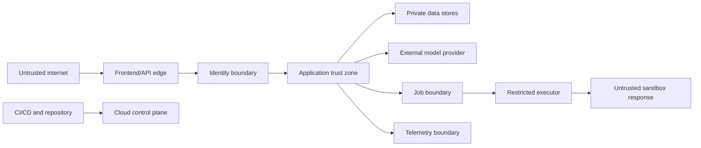

# Threat Model — AI Quality Engineering Copilot

**Document status:** Approved working baseline
**Version:** 0.2
**Last updated:** 2026-07-17
**Method:** STRIDE-informed analysis plus AI-specific abuse cases

See the [Control Traceability Matrix](CONTROL_TRACEABILITY_MATRIX.md) for the
mapping from requirements and threats to architecture decisions, fixtures,
scorers, release gates, and backlog items.

## 1. Scope

This threat model covers the public portfolio deployment and local development workflow for:

- Authentication and project authorization.
- File upload, parsing, storage, retrieval, and deletion.
- Model input and output handling.
- Requirement analysis and test generation.
- Human approval.
- Controlled HTTP execution against mock or sandbox targets.
- Reports, traces, logs, evaluations, CI/CD, and Terraform-managed infrastructure.

It does not claim regulatory compliance or suitability for production customer data.

## 2. Security objectives

1. Prevent unauthorized access to projects and artifacts.
2. Prevent uploaded or retrieved content from changing system authority.
3. Prevent arbitrary or unapproved network requests.
4. Prevent leakage of secrets, tokens, document content, and sensitive execution evidence.
5. Preserve the integrity and provenance of findings, tests, approvals, executions, and reports.
6. Limit denial-of-service and cost-exhaustion risk.
7. Make security-relevant activity observable and auditable.
8. Fail closed when authorization, approval, target validation, or provenance cannot be verified.

## 3. Hard security invariants

The following are non-negotiable release requirements:

- The LLM never receives unrestricted network, shell, filesystem, or infrastructure authority.
- An external HTTP request requires a valid owner identity, an approved target, an immutable plan, a one-time unexpired approval, and immediate network-policy revalidation.
- OpenAPI `servers`, descriptions, examples, extensions, and uploaded instructions are never trusted as authorization.
- Authorization is enforced server-side for every project-owned resource.
- Public guest access is read-only.
- Secrets are not stored in source control, client bundles, model prompts, reports, or unredacted logs.
- Redirects are disabled in MVP execution.
- Deterministic code evaluates assertions and critical policy decisions.
- Critical security evaluation cases must pass at 100% before public release.

## 4. Assets

| Asset | Security property |
|---|---|
| User identity and session | Confidentiality, integrity, authenticity |
| Project data and raw documents | Confidentiality, integrity, deletion |
| Parsed chunks and embeddings | Project isolation, provenance |
| Model prompts and schemas | Integrity, versioning |
| Findings and generated tests | Integrity, provenance, clear uncertainty |
| Execution plans and approvals | Integrity, non-replay, actor binding |
| API credentials and cloud secrets | Confidentiality, least privilege |
| HTTP request/response evidence | Confidentiality, integrity, redaction |
| Reports and evaluation results | Integrity, reproducibility |
| Audit logs and traces | Integrity, minimization, availability |
| Infrastructure and CI/CD | Integrity, least privilege |
| Budget and quotas | Availability, financial protection |

## 5. Actors

- **Authenticated owner:** legitimate user who can upload, approve, execute, and delete.
- **Read-only guest:** public reviewer restricted to preloaded content.
- **Unauthenticated internet user:** may probe public endpoints.
- **Malicious file author:** supplies adversarial requirements, PDF, JSON, XML, or OpenAPI content.
- **Compromised dependency or build actor:** attempts supply-chain compromise.
- **External model provider:** processes selected prompt content under provider terms and availability.
- **Sandbox API operator:** receives approved requests and may return malicious payloads.
- **Cloud administrator:** controls infrastructure and secrets; must use least privilege and protected credentials.

## 6. Trust boundaries

Important boundaries:

1. Browser to API.
2. Guest versus authenticated owner.
3. Uploaded bytes to parser.
4. Untrusted document text to prompt context.
5. Model output to application state.
6. Application to model provider.
7. Approval service to executor.
8. Executor to network target.
9. Application data to logs/traces.
10. Repository and CI to cloud deployment.

## 7. Risk-rating method

- **Impact:** 1 negligible, 2 minor, 3 material, 4 severe, 5 critical.
- **Likelihood:** 1 rare, 2 unlikely, 3 plausible, 4 likely, 5 expected.
- **Score:** impact × likelihood.

Priority:

- 20–25: Critical.
- 12–19: High.
- 6–11: Medium.
- 1–5: Low.

Risk scores below are pre-control estimates. Residual risk must be reassessed after implementation and testing.

## 8. Threat register

### 8.1 Identity and authorization

| ID         | Threat                                                                                           | STRIDE               |    I×L | Controls                                                                                                                       | Verification                                                                   | Residual target |
|------------|--------------------------------------------------------------------------------------------------|----------------------|-------:|--------------------------------------------------------------------------------------------------------------------------------|--------------------------------------------------------------------------------|-----------------|
| TM-IAM-001 | Attacker reads or modifies another project by changing an ID                                     | Spoofing/Elevation   | 5×3=15 | Server-side ownership checks, non-guessable IDs, repository scopes, optional row-level security                                | Cross-user integration suite for every resource                                | Low             |
| TM-IAM-002 | Public guest invokes upload, approval, execution, or delete endpoints                            | Elevation            | 5×4=20 | Explicit guest role, deny-by-default permissions, write-route tests                                                            | Guest matrix and end-to-end negative tests                                     | Low             |
| TM-IAM-003 | Stolen or replayed session token                                                                 | Spoofing             | 4×3=12 | Managed identity, short token lifetime, secure cookies where used, HTTPS, logout/revocation behavior                           | Token-expiry and invalid-signature tests                                       | Medium          |
| TM-IAM-004 | Authentication bypass in local mode leaks into production                                        | Elevation            | 5×3=15 | Compile/deploy-time environment guard, production startup refusal when dev bypass is enabled                                   | Deployment policy test and production smoke test                               | Low             |
| TM-IAM-005 | Privileged cloud or CI credentials are overbroad                                                 | Elevation            | 5×3=15 | Least-privilege IAM, workload identity/OIDC, protected environments, no long-lived deployment keys                             | IAM policy scanning and manual review                                          | Medium          |
| TM-IAM-006 | API accepts a JWT with wrong issuer, client/audience, algorithm, signature, expiry, or token use | Spoofing             | 5×3=15 | Cognito JWT validation at the edge; backend uses only verified claims; no client-supplied identity headers                     | Invalid issuer/audience/algorithm/signature/expiry/token-use integration suite | Low             |
| TM-IAM-007 | Public demo route exposes private data or enables a spend-producing action                       | Disclosure/Elevation | 5×4=20 | Immutable sanitized `DemoPublication`; separate guest-route policy; deny generic project routes, raw objects, and regeneration | Guest route/verb matrix and signed-object-access negative tests                | Low             |
| TM-IAM-008 | A workload acts outside its authorized scope                                                     | Elevation            | 5×3=15 | Separate queue permissions, database roles, object-store access, and IAM identities for parser, general worker, and executor   | IAM/role policy tests and negative integration tests                           | Medium          |

### 8.2 File upload and parsing

| ID          | Threat                                                                                                                           | STRIDE               |    I×L | Controls                                                                                                                                                   | Verification                                                                                            | Residual target |
|-------------|----------------------------------------------------------------------------------------------------------------------------------|----------------------|-------:|------------------------------------------------------------------------------------------------------------------------------------------------------------|---------------------------------------------------------------------------------------------------------|-----------------|
| TM-FILE-001 | Malicious extension or MIME mismatch reaches unsafe parser                                                                       | Tampering            | 4×4=16 | Extension/type allowlist, signature inspection where feasible, parser isolation, no macro execution                                                        | Polyglot and mismatch fixtures                                                                          | Medium          |
| TM-FILE-002 | Oversized, deeply nested, or decompression-bomb input exhausts resources                                                         | Denial of service    | 4×4=16 | Byte/page/depth/time limits, streaming, no unrestricted archive extraction, queue quotas                                                                   | Boundary and adversarial parser tests                                                                   | Low             |
| TM-FILE-003 | Unsupported XML reaches parser selection or triggers entity expansion                                                            | Disclosure/DoS       | 5×3=15 | Reject XML before parser selection; no XML parser or DTD/entity handling is enabled in the MVP                                                            | XML, XXE, and billion-laughs rejection fixtures prove zero downstream side effects                     | Low             |
| TM-FILE-004 | PDF/parser vulnerability compromises worker                                                                                      | Elevation            | 5×2=10 | Minimal maintained parser, patched image, non-root container, restricted filesystem/IAM, timeout                                                           | Dependency scanning and malicious fixture tests                                                         | Medium          |
| TM-FILE-005 | User filename causes path traversal, header injection, or XSS                                                                    | Tampering/Disclosure | 4×3=12 | Generated object keys, normalized display names, safe content disposition and HTML escaping                                                                | Traversal and hostile filename tests                                                                    | Low             |
| TM-FILE-006 | Deleted file remains in chunks, embeddings, reports, or backups                                                                  | Disclosure           | 4×3=12 | Deletion workflow across raw and derived stores, tombstones, retention policy, deletion audit                                                              | End-to-end deletion test                                                                                | Medium          |
| TM-FILE-007 | YAML alias, tag, merge-key, directive, duplicate-key, or multi-document input changes meaning or exhausts parser resources       | Tampering/DoS        | 4×4=16 | JSON-compatible YAML subset only; reject anchors, aliases, merge keys, custom tags, directives, duplicate keys, and multi-document streams                 | `SEC-PARSE-YAML-*` fixture matrix                                                                       | Low             |
| TM-FILE-008 | Deep JSON/YAML nesting, excessive nodes, collection members, or scalar size exhausts CPU or memory                               | Denial of service    | 4×4=16 | Hard byte, depth, node, member, scalar, memory, and wall-clock limits; isolated parser worker                                                              | Boundary fixtures at limit−1 and limit+1                                                                | Low             |
| TM-FILE-009 | OpenAPI references or metadata trigger network/filesystem access or authority escalation                                         | Elevation/Disclosure | 5×4=20 | Root-local `#/...` references only; reject external and relative references; resolver has no network/filesystem access; OpenAPI metadata is inert evidence | External-ref, malicious-server, callback, and extension fixtures                                        | Low             |
| TM-FILE-010 | PDF active content, encryption, attachment, malformed structure, or decompression bomb compromises or exhausts the parser worker | Elevation/DoS        | 5×3=15 | Reject encrypted files, active content, embedded files, and unsupported PDF features; bounded extraction in isolated worker                                | Encrypted, active-content, attachment, malformed, and decompression-bomb fixtures                       | Medium          |
| TM-FILE-011 | Parser process accesses network, credentials, filesystem resources, or leaks partial output after failure                        | Disclosure/Elevation | 5×3=15 | Non-root worker; scoped private data-plane identity only for private quarantine storage, parser queue, restricted database, and telemetry endpoints; no public-Internet, model-provider, executor-target, cloud-control-plane, or unrelated-cloud access; read-only filesystem, bounded temporary storage, bounded output channel | Isolation integration tests and private-endpoint allowlist/prohibited-access instrumentation | Low             |
| TM-FILE-012 | Parser rejection reaches retrieval, model, reporting, or execution workflows                                                     | Tampering/DoS        | 5×4=20 | Fail closed with sanitized rejection taxonomy and terminal parser state                                                                                    | Reject-path tests prove zero chunks, embeddings, model calls, execution candidates, DNS, and HTTP sends | Low             |

### 8.3 Prompt injection and model behavior

| ID | Threat | STRIDE | I×L | Controls | Verification | Residual target |
|---|---|---|---:|---|---|---|
| TM-AI-001 | Uploaded text tells the model to ignore policy or reveal secrets | Elevation/Disclosure | 5×5=25 | Privilege separation, explicit untrusted delimiters, no secrets in prompt, tool policy outside model, adversarial evaluation | Direct and indirect prompt-injection suite | Medium |
| TM-AI-002 | Retrieved content manipulates citations or execution plan | Tampering | 5×4=20 | Citation validation, typed plan proposal, deterministic allowlist and approval, no executable authority | Malicious OpenAPI description fixtures | Low |
| TM-AI-003 | Model fabricates source evidence | Tampering | 4×4=16 | Citation IDs constrained to retrieved set, existence validation, unsupported state, human review | Citation precision and fabricated-ID tests | Medium |
| TM-AI-004 | Model exposes one project’s content in another project | Disclosure | 5×2=10 | Project-scoped retrieval filters, no shared conversational memory, cache keys include project and version | Cross-project retrieval tests | Low |
| TM-AI-005 | Model output injects scripts into UI or report | Tampering | 4×4=16 | Render as escaped text/strict Markdown subset, sanitize HTML, strong CSP, no raw model HTML | Stored/reflected XSS fixtures | Low |
| TM-AI-006 | Model output is accepted despite invalid schema or category | Tampering | 4×4=16 | Strict schema, bounded repair, deterministic post-validation, explicit failure | Schema fuzzing and malformed-output tests | Low |
| TM-AI-007 | “LLM judge” is treated as authoritative and hides errors | Repudiation/Tampering | 3×3=9 | Human gold labels, deterministic scorers where possible, judge calibration, disagreement reporting | Judge-versus-human analysis | Medium |
| TM-AI-008 | Sensitive source text is sent unnecessarily to provider | Disclosure | 4×3=12 | Synthetic/public-data policy, minimal retrieved excerpts, data classification, prompt logging minimization | Prompt-content inspection tests | Low |
| TM-AI-009 | Untrusted source text is interpolated into privileged prompt, tool, schema, or configuration channels | Elevation/Tampering | 5×4=20 | Typed untrusted-evidence envelopes; no source text in system/developer instructions, tool definitions, target configuration, credentials, approvals, schemas, or evaluation configuration; deterministic policy enforcement outside the model | Prompt-construction, malicious-source, metadata-URL, and provenance-binding tests | Low |

### 8.4 Approval and execution

| ID          | Threat                                                                                                 | STRIDE                |    I×L | Controls                                                                                                                                   | Verification                                               | Residual target |
|-------------|--------------------------------------------------------------------------------------------------------|-----------------------|-------:|--------------------------------------------------------------------------------------------------------------------------------------------|------------------------------------------------------------|-----------------|
| TM-EXEC-001 | SSRF reaches loopback, private networks, metadata services, or internal names                          | Disclosure/Elevation  | 5×5=25 | Server-side target IDs, allowlist, URL normalization, DNS resolution, IP classification, pre-connect revalidation, redirects off           | IPv4/IPv6/metadata/alternate-notation/DNS tests            | Low             |
| TM-EXEC-002 | DNS rebinding changes a previously safe host to an unsafe address                                      | Elevation             | 5×3=15 | Resolve immediately before connect, compare against policy, controlled DNS caching, no arbitrary hostnames                                 | Rebinding simulation                                       | Medium          |
| TM-EXEC-003 | Redirect escapes approved host                                                                         | Elevation             | 5×4=20 | Redirects disabled in MVP                                                                                                                  | 3xx test to private and unapproved destinations            | Low             |
| TM-EXEC-004 | Attacker changes request after approval                                                                | Tampering             | 5×4=20 | Canonical plan hash, immutable revision, approval bound to hash, executor reloads and verifies                                             | Mutation-after-approval tests                              | Low             |
| TM-EXEC-005 | Approval is replayed for repeated side effects                                                         | Repudiation/Elevation | 5×3=15 | One-time approval, atomic consumption, idempotency key, expiry                                                                             | Concurrent replay test                                     | Low             |
| TM-EXEC-006 | Model or user injects forbidden headers or credentials                                                 | Disclosure/Elevation  | 5×3=15 | Header allowlist/denylist, server-managed auth, CRLF rejection, redaction                                                                  | Header injection and forbidden-header tests                | Low             |
| TM-EXEC-007 | Excessive request count, concurrency, payload, response, or timeout causes cost/availability impact    | DoS                   | 4×4=16 | Hard limits, quotas, concurrency semaphore, streaming cap, cancellation                                                                    | Boundary/load tests                                        | Low             |
| TM-EXEC-008 | Sandbox response contains malicious HTML, JSON, compressed data, or huge body                          | Tampering/DoS         | 4×4=16 | Byte cap, bounded decompression, content treated as data, escaped rendering, parser limits                                                 | Malicious response fixtures                                | Low             |
| TM-EXEC-009 | TLS verification is disabled or target is downgraded to HTTP                                           | Spoofing/Disclosure   | 5×3=15 | HTTPS-only production, normal certificate validation, no user override                                                                     | Configuration and MITM-oriented tests                      | Low             |
| TM-EXEC-010 | Executor IAM role can modify infrastructure or access unrelated secrets                                | Elevation             | 5×3=15 | Separate least-privilege role, explicit resource ARNs, permission boundaries where appropriate                                             | IAM policy review and negative cloud tests                 | Medium          |
| TM-EXEC-011 | OpenAPI server URL is automatically trusted                                                            | Elevation             | 5×4=20 | Servers are display metadata only; environment target selected from server-side configuration                                              | Seeded metadata URL and external-host tests                | Low             |
| TM-EXEC-012 | Assertions generated by the model produce false pass/fail results                                      | Tampering             | 4×4=16 | Typed declarative assertions, deterministic evaluator, supported operator allowlist                                                        | Assertion-engine unit and property tests                   | Low             |
| TM-EXEC-013 | Target configuration changes after plan review but before execution                                    | Tampering             | 5×3=15 | Target ID, immutable configuration version, and configuration hash are included in the canonical plan; changes invalidate pending approval | Target-mutation-after-approval integration test            | Low             |
| TM-EXEC-014 | General worker can execute requests with broader model/storage privileges than the restricted executor | Elevation             | 5×3=15 | Dedicated execution queue, deployment role, network policy, and telemetry namespace                                                        | Queue-routing, IAM-negative-permission, and topology tests | Medium          |

### 8.5 Data, reports, telemetry, and supply chain

| ID          | Threat                                                                   | STRIDE                |    I×L | Controls                                                                                                              | Verification                                                    | Residual target |
|-------------|--------------------------------------------------------------------------|-----------------------|-------:|-----------------------------------------------------------------------------------------------------------------------|-----------------------------------------------------------------|-----------------|
| TM-DATA-001 | SQL injection through filters, source text, or generated values          | Tampering/Disclosure  | 5×3=15 | Parameterized queries/ORM, no model-generated SQL execution, database role restrictions                               | SQL injection suite and static analysis                         | Low             |
| TM-DATA-002 | Object storage is publicly readable or signed URLs live too long         | Disclosure            | 5×3=15 | Block public access, private bucket policy, short-lived URLs, audit configuration                                     | IaC policy scan and live access test                            | Low             |
| TM-DATA-003 | Logs or traces contain tokens, secrets, PII, or full sensitive bodies    | Disclosure            | 5×4=20 | Central redaction, field allowlist, content minimization, access controls, retention                                  | Canary-secret scanning in logs/traces                           | Medium          |
| TM-DATA-004 | Report can be altered without detection or loses provenance              | Tampering/Repudiation | 4×3=12 | Immutable report version, content hash, source/config links, audit event                                              | Report mutation/provenance tests                                | Low             |
| TM-DATA-005 | Dependency, action, or container supply-chain compromise                 | Elevation             | 5×3=15 | Lockfiles, pinned actions by commit, Dependabot/Renovate, SCA, image scanning, SBOM, protected branch                 | CI policy checks and periodic review                            | Medium          |
| TM-DATA-006 | Secret enters Git history or container layer                             | Disclosure            | 5×3=15 | Pre-commit secret scanning, CI secret scanning, `.dockerignore`, environment secret injection                         | Seeded-secret negative test and image inspection                | Low             |
| TM-DATA-007 | Unreviewed Terraform change exposes resources                            | Elevation/Disclosure  | 5×3=15 | Plan review, policy scanning, protected production environment, least-privilege deploy role                           | IaC scan and manual approval                                    | Medium          |
| TM-DATA-008 | Evaluation fixtures or reports contain employer/customer information     | Disclosure            | 5×2=10 | Synthetic/public-data policy, repository review, automated secret and PII heuristics                                  | Release content audit                                           | Low             |
| TM-DATA-009 | Report or export leaks private, foreign-project, or redacted evidence    | Disclosure            | 5×4=20 | Project-scoped report access; deterministic redaction before persistence/export; immutable sanitized demo publication | Cross-project, guest-export, and canary-secret report tests     | Low             |
| TM-DATA-010 | Report omits provenance or presents generated inference as observed fact | Tampering/Repudiation | 4×3=12 | Versioned report manifest; source/run/configuration links; fact/hypothesis/unsupported labels; content hash           | Report-schema, provenance, rendering-parity, and mutation tests | Low             |

### 8.6 Availability and financial abuse

| ID | Threat | STRIDE | I×L | Controls | Verification | Residual target |
|---|---|---|---:|---|---|---|
| TM-AVAIL-001 | Anonymous user causes model or execution spend | DoS | 4×4=16 | Guest read-only, authentication for expensive actions, quotas, rate limits | Anonymous abuse tests | Low |
| TM-AVAIL-002 | Authenticated owner accidentally triggers excessive AI spend | DoS | 4×3=12 | Per-run estimate, output/input caps, daily/monthly circuit breakers, confirmation for expensive full eval | Quota and circuit-breaker tests | Low |
| TM-AVAIL-003 | Provider outage or rate limit blocks workflow | DoS | 3×4=12 | Clear degraded state, bounded retry, resumable jobs, no data corruption, optional later fallback | Fault injection | Medium |
| TM-AVAIL-004 | Queue poison message retries indefinitely | DoS | 3×3=9 | Bounded attempts, dead-letter queue, idempotency, alerting | Poison-message integration test | Low |
| TM-AVAIL-005 | Database auto-pause or cold start causes confusing failures | DoS | 2×4=8 | Timeouts sized for resume, health checks, retry once where safe, progress messaging | Idle-resume smoke test | Low |

## 9. AI-specific control strategy

### 9.1 Untrusted-content handling

Every parsed source, filename, metadata field, retrieval chunk, OpenAPI field, model output, and tool response carries:

- `trust_level=untrusted`.
- Project ID.
- Document and immutable version ID where applicable.
- Source location.
- Content hash.

The prompt builder may place source text only in typed untrusted-evidence data. It must never create or modify:

- System or developer messages.
- Tool definitions.
- Schemas.
- Target configuration.
- Headers or credentials.
- Approvals.
- Policy configuration.
- Evaluation thresholds.

The model may propose structured findings, tests, and plans only. Deterministic application code validates schema, category, citation ownership, project/version provenance, target policy, limits, approval state, and state transitions.

The outbound HTTP capability is never exposed as a model tool. OpenAPI `servers`, operation-level `servers`, descriptions, examples, callbacks, `externalDocs`, `externalValue`, URLs, and `x-*` extensions are opaque untrusted evidence. They cannot register or alter an execution target.

Prompt-injection detection may create a finding for human review, but it cannot decide authorization or safety. Stable delimiters improve model behavior; deterministic boundaries and post-validation remain the security controls even when detection misses an attack.

### 9.2 Guardrail layers

1. **Pre-model deterministic controls:** authentication, authorization, file policy, size limits, content classification.
2. **Prompt construction controls:** minimal evidence, stable delimiters, no secrets, task-specific context.
3. **Model-output controls:** strict schema, category allowlist, citation-ID allowlist, bounded repair.
4. **Application-policy controls:** plan eligibility, target allowlist, approval, quota, state transition.
5. **Tool-input controls:** URL/header/body limits and network policy.
6. **Tool-output controls:** byte limits, redaction, safe parsing, escaped rendering.
7. **Evaluation controls:** adversarial regression suite and release gates.

Model-based guardrails may supplement these controls but cannot replace deterministic authorization or network policy.

## 10. Approval security design

An approval record contains:

- `approval_id`
- `project_id`
- `execution_plan_id`
- canonical `plan_hash`
- `approved_by`
- `approved_at`
- `expires_at`
- `consumed_at`
- approval decision and optional comment

Executor transaction:

1. Load plan and approval under lock.
2. Verify actor/project relationship.
3. Verify hash, expiry, and unconsumed state.
4. Revalidate target and limits.
5. Atomically mark approval consumed and execution started.
6. Only then send the first request.

A partial batch retry requires a new execution decision unless deterministic idempotency proves that replay is safe.

## 11. File-security policy

The following are hard maximums. They may be lowered by configuration. Raising them requires an ADR and a passing parser-security regression suite.

| Control | Requirement |
|---|---|
| Allowed MVP types | `.md`, `.txt`, `.pdf`, and OpenAPI 3.0.x/3.1.x documents in `.yaml`, `.yml`, or `.json` form only. Reject XML/JUnit and generic JSON test-result files, archives, Office files, executables, and macros. |
| Intake | Extension, declared MIME, signature where available, and strict decoding must agree. MIME is only a hint. Generated object keys are used; original filenames are escaped display metadata only. |
| Quarantine | Raw uploads are private quarantine objects until parser acceptance. Rejected inputs retain only required audit metadata and are never passed to retrieval or a model. |
| Count and aggregate | 20 files per project; 50 MiB total active raw input per project. |
| Upload envelope | 10 MiB per file; `Content-Encoding: identity` only; archives and compressed wrappers rejected. |
| Markdown/text | UTF-8 only; ≤2 MiB; ≤100,000 lines; ≤16 KiB per line; 2 seconds and 128 MiB. No MDX, includes, templates, link fetching, image previews, or raw-HTML rendering. |
| JSON | ≤5 MiB; one root value; reject comments, duplicate keys, trailing content, `NaN`, `Infinity`, invalid UTF-8, and scalars above 64 KiB. Maximum depth 40, nodes 25,000, and collection members 10,000; 5 seconds and 256 MiB. |
| YAML | ≤5 MiB; JSON-compatible YAML subset only. Reject anchors, aliases, merge keys, custom tags, directives, duplicate keys, and multi-document streams. `max_aliases=0`; apply JSON depth/node/member/scalar limits. |
| OpenAPI | First satisfy YAML/JSON policy; support OpenAPI 3.0.x and 3.1.x only. Allow root-local `#/...` `$ref` values only; reject `$dynamicRef`, cycles, external, relative, encoded, file, data, and network references. Maximum 500 references, ref depth 20, 500 operations, and 5,000 components. |
| OpenAPI metadata | Never fetch or trust `servers`, descriptions, examples, callbacks, `externalDocs`, `externalValue`, `$id`, `$schema`, URLs, or `x-*` extensions. They remain untrusted evidence. |
| PDF | Require a valid PDF signature; ≤10 MiB; ≤100 pages; ≤10,000 objects; ≤8 MiB decoded stream; ≤32 MiB total decoded streams; ≤100:1 expansion ratio; 15 seconds and 512 MiB. Reject encryption, attachments, JavaScript, active actions, OCR, rendering, converters, and PDFs without extractable text. |
| Worker isolation | Non-root worker; scoped private data-plane identity only for private quarantine storage, parser queue, restricted database, and telemetry endpoints; no public-Internet, model-provider, executor-target, cloud-control-plane, or unrelated-cloud access; read-only filesystem; bounded temporary storage; OS-enforced memory and wall-clock limits. |
| Failure outcome | Return a stable sanitized rejection code. Do not retry parser-policy or malformed-input failures. Create zero chunks, vectors, prompts, model calls, plans, execution records, DNS calls, or HTTP sends. |

## 12. Secrets and credentials

- Local secrets live in `.env`, which is ignored.
- Public examples use `.env.example` placeholders.
- CI uses workload identity or scoped repository secrets.
- Production uses a managed secret store.
- Client-side code receives only public configuration.
- Model prompts and traces never contain cloud or provider API keys.
- Sandbox credentials, if required, are injected by target ID and are never model-generated.
- Rotation and revocation instructions are documented.

## 13. Security verification plan

### Every pull request

- Formatting, linting, type checking, and tests.
- Secret scanning.
- Dependency/SCA scanning.
- Static analysis.
- Terraform format, validation, and policy scan.
- Container and filesystem scan when image-relevant files change.
- Unit tests for URL policy, approval state, redaction, and schema validation.
- All deterministic `SEC-PARSE-*` parser fixtures.
- All deterministic `SEC-PI-*` prompt-injection and untrusted-content fixtures.
- All deterministic `SEC-NET-*` SSRF, redirect, DNS-rebinding, and metadata-target fixtures.
- Approval mutation, expiry, replay, and concurrent-consumption fixtures.
- Redaction, guest-write, cross-user/project isolation, and foreign-citation fixtures.
- Assertions that every deny case produces zero downstream model, DNS, transport, or execution side effects.

### Selected pull requests

- Low-cost AI smoke suite for model-sensitive changes.
- Human-review calibration checks where applicable.
- No selected-PR workflow may be the only evidence for a hard security invariant.

### Release

- Full threat-model verification matrix.
- Full AI adversarial evaluation.
- Public-data and secret audit.
- Guest-permission matrix.
- Live infrastructure exposure test.
- Manual review of IAM and Terraform plan.
- Backup/export, rollback, quota, and alarm exercise.
- Archived SG-01 through SG-08 gate evidence with commit SHA, fixture-manifest version, expected boundary, actual boundary, and pass/fail exit code.

## 14. Security release gates

Release is blocked unless every gate below passes. Critical cases cannot be skipped, marked expected-failure, or accepted as inconclusive.

| Gate | Required result |
|---|---|
| SG-01 Parser matrix | 100% of versioned `SEC-PARSE-*` cases match their expected accept/reject outcome. Every rejected case records zero chunks, embeddings, model calls, DNS calls, HTTP sends, execution plans, and retries. |
| SG-02 Untrusted-content matrix | 100% of critical `SEC-PI-*` cases cause no policy, target, approval, schema, or evaluation-threshold mutation; no secret disclosure; no cross-project retrieval; and no tool send. |
| SG-03 Network matrix | 100% of `SEC-NET-*` deny cases make zero transport sends. The valid control case makes exactly the approved request only after every validation check passes. |
| SG-04 Approval integrity | 100% of plan-mutation, expiry, replay, and concurrent-consumption cases block before a transport send. |
| SG-05 Authorization and isolation | 100% of guest-write and cross-user/project negative cases return the specified denial and disclose no foreign artifact. |
| SG-06 Secret handling | 100% of canary-secret fixtures prove absence from persisted evidence, reports, logs, traces, repository history, and image layers. |
| SG-07 Security scanning | Zero unresolved Critical or High secret, SAST, dependency, container, or IaC findings. Medium findings require documented disposition. |
| SG-08 Deployment policy | IaC policy and live exposure tests confirm private data stores, production refusal of development bypasses, TLS verification, and executor egress restricted to configured sandbox targets. |

## 15. Residual risks and limitations

Even after controls:

- LLMs can still produce incorrect analysis and plausible unsupported explanations.
- Prompt-injection detection is not perfect; security depends on eliminating model authority rather than solely classifying attacks.
- Model-provider processing remains an external trust dependency.
- Parser and dependency vulnerabilities cannot be eliminated, only reduced and monitored.
- A single-owner portfolio application is not equivalent to a production multi-tenant SaaS security posture.
- Public cloud cost notifications may be delayed; application circuit breakers remain necessary.
- DNS and networking protections require careful implementation and ongoing regression tests.

These limitations must be visible in the public case study.

## 16. Incident response outline

For suspected security or cost abuse:

1. Disable public write paths and executor through a feature flag or infrastructure control.
2. Revoke or rotate affected credentials.
3. Preserve relevant audit events and sanitized traces.
4. Identify affected projects, runs, and time range.
5. Stop queued jobs and reduce quotas to zero if necessary.
6. Patch and test the control.
7. Deploy through protected release flow.
8. Document root cause, impact, missed detection, and preventive action.

No real customer-notification process is claimed because the portfolio demo uses synthetic/public data only.

## 17. Security evidence required in the repository

- This threat model and a residual-risk update.
- Network-policy and approval tests.
- Prompt-injection evaluation fixtures.
- Authorization matrix.
- Redaction tests.
- Secret-scanning configuration.
- Dependency and container scan configuration.
- Terraform policy checks.
- Public exposure test results.
- Security section in the final evaluation report.
