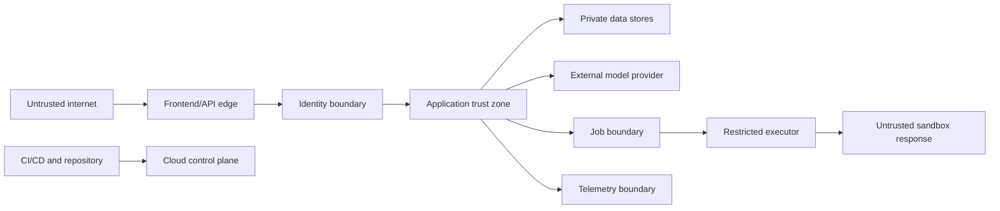

# Threat Model — AI Quality Engineering Copilot

**Document status:** Approved working baseline  
**Version:** 0.1  
**Last updated:** 2026-07-17  
**Method:** STRIDE-informed analysis plus AI-specific abuse cases

## 1. Scope

This threat model covers the public portfolio deployment and local development workflow for:

- Authentication and project authorization.
- File upload, parsing, storage, retrieval, and deletion.
- Model input and output handling.
- Requirement analysis and test generation.
- Human approval.
- Controlled HTTP execution against mock or sandbox targets.
- Reports, traces, logs, evaluations, CI/CD, and Terraform-managed infrastructure.

It does not claim regulatory compliance or suitability for production customer data.

## 2. Security objectives

1. Prevent unauthorized access to projects and artifacts.
2. Prevent uploaded or retrieved content from changing system authority.
3. Prevent arbitrary or unapproved network requests.
4. Prevent leakage of secrets, tokens, document content, and sensitive execution evidence.
5. Preserve the integrity and provenance of findings, tests, approvals, executions, and reports.
6. Limit denial-of-service and cost-exhaustion risk.
7. Make security-relevant activity observable and auditable.
8. Fail closed when authorization, approval, target validation, or provenance cannot be verified.

## 3. Hard security invariants

The following are non-negotiable release requirements:

- The LLM never receives unrestricted network, shell, filesystem, or infrastructure authority.
- An external HTTP request requires a valid owner identity, an approved target, an immutable plan, a one-time unexpired approval, and immediate network-policy revalidation.
- OpenAPI `servers`, descriptions, examples, extensions, and uploaded instructions are never trusted as authorization.
- Authorization is enforced server-side for every project-owned resource.
- Public guest access is read-only.
- Secrets are not stored in source control, client bundles, model prompts, reports, or unredacted logs.
- Redirects are disabled in MVP execution.
- Deterministic code evaluates assertions and critical policy decisions.
- Critical security evaluation cases must pass at 100% before public release.

## 4. Assets

| Asset | Security property |
|---|---|
| User identity and session | Confidentiality, integrity, authenticity |
| Project data and raw documents | Confidentiality, integrity, deletion |
| Parsed chunks and embeddings | Project isolation, provenance |
| Model prompts and schemas | Integrity, versioning |
| Findings and generated tests | Integrity, provenance, clear uncertainty |
| Execution plans and approvals | Integrity, non-replay, actor binding |
| API credentials and cloud secrets | Confidentiality, least privilege |
| HTTP request/response evidence | Confidentiality, integrity, redaction |
| Reports and evaluation results | Integrity, reproducibility |
| Audit logs and traces | Integrity, minimization, availability |
| Infrastructure and CI/CD | Integrity, least privilege |
| Budget and quotas | Availability, financial protection |

## 5. Actors

- **Authenticated owner:** legitimate user who can upload, approve, execute, and delete.
- **Read-only guest:** public reviewer restricted to preloaded content.
- **Unauthenticated internet user:** may probe public endpoints.
- **Malicious file author:** supplies adversarial requirements, PDF, JSON, XML, or OpenAPI content.
- **Compromised dependency or build actor:** attempts supply-chain compromise.
- **External model provider:** processes selected prompt content under provider terms and availability.
- **Sandbox API operator:** receives approved requests and may return malicious payloads.
- **Cloud administrator:** controls infrastructure and secrets; must use least privilege and protected credentials.

## 6. Trust boundaries

Important boundaries:

1. Browser to API.
2. Guest versus authenticated owner.
3. Uploaded bytes to parser.
4. Untrusted document text to prompt context.
5. Model output to application state.
6. Application to model provider.
7. Approval service to executor.
8. Executor to network target.
9. Application data to logs/traces.
10. Repository and CI to cloud deployment.

## 7. Risk-rating method

- **Impact:** 1 negligible, 2 minor, 3 material, 4 severe, 5 critical.
- **Likelihood:** 1 rare, 2 unlikely, 3 plausible, 4 likely, 5 expected.
- **Score:** impact × likelihood.

Priority:

- 20–25: Critical.
- 12–19: High.
- 6–11: Medium.
- 1–5: Low.

Risk scores below are pre-control estimates. Residual risk must be reassessed after implementation and testing.

## 8. Threat register

### 8.1 Identity and authorization

| ID | Threat | STRIDE | I×L | Controls | Verification | Residual target |
|---|---|---|---:|---|---|---|
| TM-IAM-001 | Attacker reads or modifies another project by changing an ID | Spoofing/Elevation | 5×3=15 | Server-side ownership checks, non-guessable IDs, repository scopes, optional row-level security | Cross-user integration suite for every resource | Low |
| TM-IAM-002 | Public guest invokes upload, approval, execution, or delete endpoints | Elevation | 5×4=20 | Explicit guest role, deny-by-default permissions, write-route tests | Guest matrix and end-to-end negative tests | Low |
| TM-IAM-003 | Stolen or replayed session token | Spoofing | 4×3=12 | Managed identity, short token lifetime, secure cookies where used, HTTPS, logout/revocation behavior | Token-expiry and invalid-signature tests | Medium |
| TM-IAM-004 | Authentication bypass in local mode leaks into production | Elevation | 5×3=15 | Compile/deploy-time environment guard, production startup refusal when dev bypass is enabled | Deployment policy test and production smoke test | Low |
| TM-IAM-005 | Privileged cloud or CI credentials are overbroad | Elevation | 5×3=15 | Least-privilege IAM, workload identity/OIDC, protected environments, no long-lived deployment keys | IAM policy scanning and manual review | Medium |

### 8.2 File upload and parsing

| ID | Threat | STRIDE | I×L | Controls | Verification | Residual target |
|---|---|---|---:|---|---|---|
| TM-FILE-001 | Malicious extension or MIME mismatch reaches unsafe parser | Tampering | 4×4=16 | Extension/type allowlist, signature inspection where feasible, parser isolation, no macro execution | Polyglot and mismatch fixtures | Medium |
| TM-FILE-002 | Oversized, deeply nested, or decompression-bomb input exhausts resources | Denial of service | 4×4=16 | Byte/page/depth/time limits, streaming, no unrestricted archive extraction, queue quotas | Boundary and adversarial parser tests | Low |
| TM-FILE-003 | XML external entity or entity-expansion attack | Disclosure/DoS | 5×3=15 | Hardened XML parser, DTD/external entity disabled, size limits | XXE and billion-laughs fixtures | Low |
| TM-FILE-004 | PDF/parser vulnerability compromises worker | Elevation | 5×2=10 | Minimal maintained parser, patched image, non-root container, restricted filesystem/IAM, timeout | Dependency scanning and malicious fixture tests | Medium |
| TM-FILE-005 | User filename causes path traversal, header injection, or XSS | Tampering/Disclosure | 4×3=12 | Generated object keys, normalized display names, safe content disposition and HTML escaping | Traversal and hostile filename tests | Low |
| TM-FILE-006 | Deleted file remains in chunks, embeddings, reports, or backups | Disclosure | 4×3=12 | Deletion workflow across raw and derived stores, tombstones, retention policy, deletion audit | End-to-end deletion test | Medium |

### 8.3 Prompt injection and model behavior

| ID | Threat | STRIDE | I×L | Controls | Verification | Residual target |
|---|---|---|---:|---|---|---|
| TM-AI-001 | Uploaded text tells the model to ignore policy or reveal secrets | Elevation/Disclosure | 5×5=25 | Privilege separation, explicit untrusted delimiters, no secrets in prompt, tool policy outside model, adversarial evaluation | Direct and indirect prompt-injection suite | Medium |
| TM-AI-002 | Retrieved content manipulates citations or execution plan | Tampering | 5×4=20 | Citation validation, typed plan proposal, deterministic allowlist and approval, no executable authority | Malicious OpenAPI description fixtures | Low |
| TM-AI-003 | Model fabricates source evidence | Tampering | 4×4=16 | Citation IDs constrained to retrieved set, existence validation, unsupported state, human review | Citation precision and fabricated-ID tests | Medium |
| TM-AI-004 | Model exposes one project’s content in another project | Disclosure | 5×2=10 | Project-scoped retrieval filters, no shared conversational memory, cache keys include project and version | Cross-project retrieval tests | Low |
| TM-AI-005 | Model output injects scripts into UI or report | Tampering | 4×4=16 | Render as escaped text/strict Markdown subset, sanitize HTML, strong CSP, no raw model HTML | Stored/reflected XSS fixtures | Low |
| TM-AI-006 | Model output is accepted despite invalid schema or category | Tampering | 4×4=16 | Strict schema, bounded repair, deterministic post-validation, explicit failure | Schema fuzzing and malformed-output tests | Low |
| TM-AI-007 | “LLM judge” is treated as authoritative and hides errors | Repudiation/Tampering | 3×3=9 | Human gold labels, deterministic scorers where possible, judge calibration, disagreement reporting | Judge-versus-human analysis | Medium |
| TM-AI-008 | Sensitive source text is sent unnecessarily to provider | Disclosure | 4×3=12 | Synthetic/public-data policy, minimal retrieved excerpts, data classification, prompt logging minimization | Prompt-content inspection tests | Low |

### 8.4 Approval and execution

| ID | Threat | STRIDE | I×L | Controls | Verification | Residual target |
|---|---|---|---:|---|---|---|
| TM-EXEC-001 | SSRF reaches loopback, private networks, metadata services, or internal names | Disclosure/Elevation | 5×5=25 | Server-side target IDs, allowlist, URL normalization, DNS resolution, IP classification, pre-connect revalidation, redirects off | IPv4/IPv6/metadata/alternate-notation/DNS tests | Low |
| TM-EXEC-002 | DNS rebinding changes a previously safe host to an unsafe address | Elevation | 5×3=15 | Resolve immediately before connect, compare against policy, controlled DNS caching, no arbitrary hostnames | Rebinding simulation | Medium |
| TM-EXEC-003 | Redirect escapes approved host | Elevation | 5×4=20 | Redirects disabled in MVP | 3xx test to private and unapproved destinations | Low |
| TM-EXEC-004 | Attacker changes request after approval | Tampering | 5×4=20 | Canonical plan hash, immutable revision, approval bound to hash, executor reloads and verifies | Mutation-after-approval tests | Low |
| TM-EXEC-005 | Approval is replayed for repeated side effects | Repudiation/Elevation | 5×3=15 | One-time approval, atomic consumption, idempotency key, expiry | Concurrent replay test | Low |
| TM-EXEC-006 | Model or user injects forbidden headers or credentials | Disclosure/Elevation | 5×3=15 | Header allowlist/denylist, server-managed auth, CRLF rejection, redaction | Header injection and forbidden-header tests | Low |
| TM-EXEC-007 | Excessive request count, concurrency, payload, response, or timeout causes cost/availability impact | DoS | 4×4=16 | Hard limits, quotas, concurrency semaphore, streaming cap, cancellation | Boundary/load tests | Low |
| TM-EXEC-008 | Sandbox response contains malicious HTML, JSON, compressed data, or huge body | Tampering/DoS | 4×4=16 | Byte cap, bounded decompression, content treated as data, escaped rendering, parser limits | Malicious response fixtures | Low |
| TM-EXEC-009 | TLS verification is disabled or target is downgraded to HTTP | Spoofing/Disclosure | 5×3=15 | HTTPS-only production, normal certificate validation, no user override | Configuration and MITM-oriented tests | Low |
| TM-EXEC-010 | Executor IAM role can modify infrastructure or access unrelated secrets | Elevation | 5×3=15 | Separate least-privilege role, explicit resource ARNs, permission boundaries where appropriate | IAM policy review and negative cloud tests | Medium |
| TM-EXEC-011 | OpenAPI server URL is automatically trusted | Elevation | 5×4=20 | Servers are display metadata only; environment target selected from server-side configuration | Seeded metadata URL and external-host tests | Low |
| TM-EXEC-012 | Assertions generated by the model produce false pass/fail results | Tampering | 4×4=16 | Typed declarative assertions, deterministic evaluator, supported operator allowlist | Assertion-engine unit and property tests | Low |

### 8.5 Data, reports, telemetry, and supply chain

| ID | Threat | STRIDE | I×L | Controls | Verification | Residual target |
|---|---|---|---:|---|---|---|
| TM-DATA-001 | SQL injection through filters, source text, or generated values | Tampering/Disclosure | 5×3=15 | Parameterized queries/ORM, no model-generated SQL execution, database role restrictions | SQL injection suite and static analysis | Low |
| TM-DATA-002 | Object storage is publicly readable or signed URLs live too long | Disclosure | 5×3=15 | Block public access, private bucket policy, short-lived URLs, audit configuration | IaC policy scan and live access test | Low |
| TM-DATA-003 | Logs or traces contain tokens, secrets, PII, or full sensitive bodies | Disclosure | 5×4=20 | Central redaction, field allowlist, content minimization, access controls, retention | Canary-secret scanning in logs/traces | Medium |
| TM-DATA-004 | Report can be altered without detection or loses provenance | Tampering/Repudiation | 4×3=12 | Immutable report version, content hash, source/config links, audit event | Report mutation/provenance tests | Low |
| TM-DATA-005 | Dependency, action, or container supply-chain compromise | Elevation | 5×3=15 | Lockfiles, pinned actions by commit, Dependabot/Renovate, SCA, image scanning, SBOM, protected branch | CI policy checks and periodic review | Medium |
| TM-DATA-006 | Secret enters Git history or container layer | Disclosure | 5×3=15 | Pre-commit secret scanning, CI secret scanning, `.dockerignore`, environment secret injection | Seeded-secret negative test and image inspection | Low |
| TM-DATA-007 | Unreviewed Terraform change exposes resources | Elevation/Disclosure | 5×3=15 | Plan review, policy scanning, protected production environment, least-privilege deploy role | IaC scan and manual approval | Medium |
| TM-DATA-008 | Evaluation fixtures or reports contain employer/customer information | Disclosure | 5×2=10 | Synthetic/public-data policy, repository review, automated secret and PII heuristics | Release content audit | Low |

### 8.6 Availability and financial abuse

| ID | Threat | STRIDE | I×L | Controls | Verification | Residual target |
|---|---|---|---:|---|---|---|
| TM-AVAIL-001 | Anonymous user causes model or execution spend | DoS | 4×4=16 | Guest read-only, authentication for expensive actions, quotas, rate limits | Anonymous abuse tests | Low |
| TM-AVAIL-002 | Authenticated owner accidentally triggers excessive AI spend | DoS | 4×3=12 | Per-run estimate, output/input caps, daily/monthly circuit breakers, confirmation for expensive full eval | Quota and circuit-breaker tests | Low |
| TM-AVAIL-003 | Provider outage or rate limit blocks workflow | DoS | 3×4=12 | Clear degraded state, bounded retry, resumable jobs, no data corruption, optional later fallback | Fault injection | Medium |
| TM-AVAIL-004 | Queue poison message retries indefinitely | DoS | 3×3=9 | Bounded attempts, dead-letter queue, idempotency, alerting | Poison-message integration test | Low |
| TM-AVAIL-005 | Database auto-pause or cold start causes confusing failures | DoS | 2×4=8 | Timeouts sized for resume, health checks, retry once where safe, progress messaging | Idle-resume smoke test | Low |

## 9. AI-specific control strategy

### 9.1 Untrusted-content handling

Prompts must explicitly separate:

- Privileged system policy.
- Task instructions.
- Retrieved evidence.
- User-authored content.
- Tool output.

Untrusted content can inform analysis but cannot:

- Grant permissions.
- Change the target allowlist.
- Create an approval.
- Read secrets.
- Invoke a network client.
- Alter evaluation thresholds.

### 9.2 Guardrail layers

1. **Pre-model deterministic controls:** authentication, authorization, file policy, size limits, content classification.
2. **Prompt construction controls:** minimal evidence, stable delimiters, no secrets, task-specific context.
3. **Model-output controls:** strict schema, category allowlist, citation-ID allowlist, bounded repair.
4. **Application-policy controls:** plan eligibility, target allowlist, approval, quota, state transition.
5. **Tool-input controls:** URL/header/body limits and network policy.
6. **Tool-output controls:** byte limits, redaction, safe parsing, escaped rendering.
7. **Evaluation controls:** adversarial regression suite and release gates.

Model-based guardrails may supplement these controls but cannot replace deterministic authorization or network policy.

## 10. Approval security design

An approval record contains:

- `approval_id`
- `project_id`
- `execution_plan_id`
- canonical `plan_hash`
- `approved_by`
- `approved_at`
- `expires_at`
- `consumed_at`
- approval decision and optional comment

Executor transaction:

1. Load plan and approval under lock.
2. Verify actor/project relationship.
3. Verify hash, expiry, and unconsumed state.
4. Revalidate target and limits.
5. Atomically mark approval consumed and execution started.
6. Only then send the first request.

A partial batch retry requires a new execution decision unless deterministic idempotency proves that replay is safe.

## 11. File-security policy

Initial limits:

- 10 MB per file.
- 20 files per project.
- 100 PDF pages.
- No archives.
- No executable formats.
- No macros.
- Hardened XML parsing.
- Parse in a restricted worker with time and memory bounds.
- Store original filename as escaped metadata only.

Files failing validation are rejected, not passed to the model.

## 12. Secrets and credentials

- Local secrets live in `.env`, which is ignored.
- Public examples use `.env.example` placeholders.
- CI uses workload identity or scoped repository secrets.
- Production uses a managed secret store.
- Client-side code receives only public configuration.
- Model prompts and traces never contain cloud or provider API keys.
- Sandbox credentials, if required, are injected by target ID and are never model-generated.
- Rotation and revocation instructions are documented.

## 13. Security verification plan

### Every pull request

- Formatting, linting, type checking, and tests.
- Secret scanning.
- Dependency/SCA scanning.
- Static analysis.
- Terraform format, validation, and policy scan.
- Container and filesystem scan when image-relevant files change.
- Unit tests for URL policy, approval state, redaction, and schema validation.

### Selected pull requests

- SSRF and authorization integration suite.
- Prompt-injection smoke suite.
- Cross-project retrieval tests.
- Malicious-file fixture tests.

### Release

- Full threat-model verification matrix.
- Full AI adversarial evaluation.
- Public-data and secret audit.
- Guest-permission matrix.
- Live infrastructure exposure test.
- Manual review of IAM and Terraform plan.
- Backup/export, rollback, quota, and alarm exercise.

## 14. Security release gates

Release is blocked when any of the following is true:

- A critical or high risk has no implemented mitigation or accepted residual-risk decision.
- A critical unsafe-execution fixture is not blocked.
- Prompt injection can cause a tool call, approval, secret disclosure, or policy change.
- Cross-project data can be retrieved.
- Guest can perform a write or expensive action.
- A secret appears in source control, image layers, logs, traces, or public reports.
- Object storage or database is unintentionally public.
- Approval can be replayed or altered.
- Redirect or DNS behavior can escape the allowlist.
- Public demo can target an arbitrary host.

## 15. Residual risks and limitations

Even after controls:

- LLMs can still produce incorrect analysis and plausible unsupported explanations.
- Prompt-injection detection is not perfect; security depends on eliminating model authority rather than solely classifying attacks.
- Model-provider processing remains an external trust dependency.
- Parser and dependency vulnerabilities cannot be eliminated, only reduced and monitored.
- A single-owner portfolio application is not equivalent to a production multi-tenant SaaS security posture.
- Public cloud cost notifications may be delayed; application circuit breakers remain necessary.
- DNS and networking protections require careful implementation and ongoing regression tests.

These limitations must be visible in the public case study.

## 16. Incident response outline

For suspected security or cost abuse:

1. Disable public write paths and executor through a feature flag or infrastructure control.
2. Revoke or rotate affected credentials.
3. Preserve relevant audit events and sanitized traces.
4. Identify affected projects, runs, and time range.
5. Stop queued jobs and reduce quotas to zero if necessary.
6. Patch and test the control.
7. Deploy through protected release flow.
8. Document root cause, impact, missed detection, and preventive action.

No real customer-notification process is claimed because the portfolio demo uses synthetic/public data only.

## 17. Security evidence required in the repository

- This threat model and a residual-risk update.
- Network-policy and approval tests.
- Prompt-injection evaluation fixtures.
- Authorization matrix.
- Redaction tests.
- Secret-scanning configuration.
- Dependency and container scan configuration.
- Terraform policy checks.
- Public exposure test results.
- Security section in the final evaluation report.
